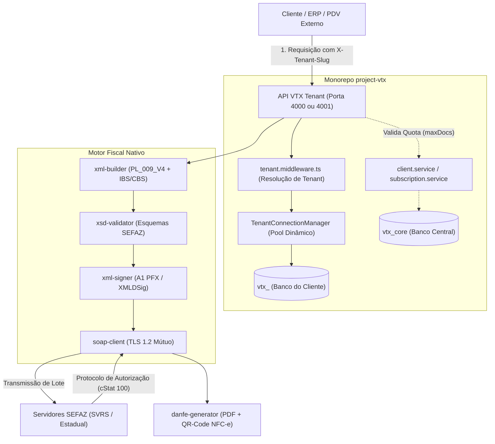

# Documento de Definição de Escopo e Arquitetura — VTX Tenant (Fase 2)

| Metadado | Detalhe |
|---|---|
| **Projeto** | `VTX Tenant — Sistema Fiscal Multi-Tenant Headless` |
| **Documento** | Escopo Oficial, Diretrizes de Negócio e Arquitetura de Software |
| **Papel do Emissor** | Product Owner (PO) & Arquiteto de Software |
| **Data de Alinhamento** | 11/09/2026 |
| **Modelo de Execução** | Monorepo Integrado ao `project-vtx` |
| **Marco Regulatório** | MOC SEFAZ (v4.00), EC 132/2023, PLP 68/2024 (Reforma Tributária IBS/CBS) |
| **Status** | 🟢 **APROVADO E HOMOLOGADO PELO STAKEHOLDER** |

---

## 1. Decisões Estratégicas Consolidadas com o Stakeholder

A partir da rodada formal de alinhamento com o Product Owner, foram firmadas as seguintes premissas mandatória para o projeto:

| Eixo Estratégico | Decisão Homologada | Justificativa Técnica / de Negócio |
|---|---|---|
| **1. Repositório de Código** | **Monorepo Integrado** (`src/modules/tenant/` ou `packages/tenant`) | Aproveitamento imediato da esteira Docker, orquestração Compose, pipeline de testes (Vitest), tipagem TypeScript e comunicação de alta velocidade em memória com o VTX Core. |
| **2. Escopo Fiscal do MVP** | **NF-e (Mod. 55) + NFC-e (Mod. 65)** desenvolvidas em conjunto | Atendimento completo tanto ao mercado B2B (mercadorias/atacado) quanto B2C (varejo e pontos de venda), permitindo comercialização rápida da solução. |
| **3. Integração SEFAZ** | **Motor Nativo Proprietário** (Node.js/TypeScript) | Zero custo de licenciamento ou transação com gateways terceiros (autonomia total). Geração própria de XML, assinatura digital XMLDSig e clientes SOAP/WSDL nativos. |
| **4. Camada de Entrega** | **100% Backend (API REST Headless)** | Máxima robustez, foco em resiliência de mensageria, concorrência, criptografia e 100% de automação de testes com cobertura estrita. |
| **5. Reforma Tributária** | **Suporte Híbrido Nativo (IBS / CBS / IS)** | O motor nasce preparado para o período de transição (2026–2032) e operação definitiva a partir de 2033, com suporte a Split Payment. |

---

## 2. Topologia Arquitetural e Fluxo Operacional



---

## 3. Estrutura de Pastas do Tenant no Monorepo

O sistema do tenant será integrado de forma modular e isolada dentro da arquitetura limpa do repositório:

```text
src/modules/tenant/
├── config/                     # Configurações fiscais e conexão por tenant
│   ├── tenant-connection.ts    # Gerenciador dinâmico de pools PostgreSQL
│   └── fiscal-config.schema.ts # Validação Zod para parâmetros da empresa
├── certificate/                # Módulo de Certificado Digital A1
│   ├── certificate.crypto.ts   # Criptografia AES-256-GCM em repouso
│   ├── certificate.parser.ts   # Extração de chaves públicas/privadas e validade
│   └── certificate.service.ts  # Gerenciamento de ciclo de vida do A1
├── customer/                   # Cadastro de destinatários fiscais (Destino)
│   ├── customer.controller.ts
│   ├── customer.service.ts
│   └── customer.schema.ts
├── product/                    # Catálogo de produtos (NCM, CEST, Reforma Tributária)
│   ├── product.controller.ts
│   ├── product.service.ts
│   └── product.schema.ts
├── fiscal/                     # Motor de Emissão e Mensageria SEFAZ
│   ├── engine/
│   │   ├── nfe-builder.ts      # Montador do XML NF-e modelo 55
│   │   ├── nfce-builder.ts     # Montador do XML NFC-e modelo 65 + QR-Code
│   │   ├── tax-calculator.ts   # Motor de cálculo (ICMS/PIS/COFINS + IBS/CBS/IS)
│   │   ├── xml-signer.ts       # Assinador XMLDSig com certificado A1
│   │   ├── xsd-validator.ts    # Validador local de esquemas XSD
│   │   └── soap-client.ts      # Cliente de transmissão SOAP/WSDL TLS 1.2
│   ├── fiscal.controller.ts
│   ├── fiscal.service.ts
│   └── fiscal.schema.ts
└── danfe/                      # Renderização do Documento Auxiliar
    ├── nfe-danfe.ts            # DANFE para NF-e (PDF com CODE128)
    └── nfce-danfe.ts           # DANFCE para NFC-e (PDF térmico 80mm com QR-Code)
```

---

## 4. Planejamento das Sprints da Fase 2 (VTX Tenant)

Seguindo o rigor do ciclo de segurança, a Fase 2 será entregue em 4 sprints progressivas e com homologação contínua:

### 🎯 **Sprint 1 (Tenant): Fundação Multi-Tenant, Banco Dedicado e Certificados A1**
* Setup da estrutura modular `src/modules/tenant/` no Monorepo;
* `TenantConnectionManager`: pool dinâmico e seguro de conexões para `vtx_<slug>`;
* Migrações do schema fiscal aplicadas dinamicamente no banco do tenant;
* Módulo de Certificado Digital A1 com Envelope Encryption (AES-256-GCM);
* Suíte de testes automatizados com mocks de banco dedicado.

### 🎯 **Sprint 2 (Tenant): Cadastros Fiscais e Motor de Tributação (Híbrido)**
* CRUD e validações estritas (Zod) de Clientes/Destinatários com código IBGE;
* CRUD de Produtos com validação de NCM, CEST e categorias da Reforma Tributária;
* Motor `tax-calculator.ts` calculando tributos tradicionais e os novos tributos (IBS / CBS / IS);
* Suíte de testes cobrindo cálculos tributários para Simples Nacional e Regime Normal.

### 🎯 **Sprint 3 (Tenant): Geração de XML, Assinatura Digital e Validação XSD**
* Montadores `nfe-builder.ts` e `nfce-builder.ts` gerando XML PL_009_V4 com nós de IBS/CBS;
* Implementação do algoritmo de QR-Code para NFC-e (versão 2.0 com hash SHA-1 do CSC);
* Assinador digital nativo `xml-signer.ts` (XMLDSig padrão ICP-Brasil);
* Validador XSD integrado contra esquemas oficiais da SEFAZ;
* Suíte de testes com validação de XMLs emitidos.

### 🎯 **Sprint 4 (Tenant): Transmissão SEFAZ, DANFE e Sincronização de Quota com o Core**
* Cliente SOAP `soap-client.ts` com comunicação TLS 1.2 com a SEFAZ (Homologação);
* Processamento síncrono e consulta de recibos de lote;
* Geração do XML de distribuição `nfeProc` e renderização de DANFE / DANFCE em PDF;
* Eventos fiscais de Cancelamento e CC-e;
* Integração com o VTX Core para abatimento da quota `maxDocs` da assinatura;
* Homologação final e emissão do relatório de entrega da Fase 2.

---

## 5. Homologação do Escopo

Este escopo formaliza todos os requisitos funcionais, não funcionais e regulatórios alinhados com o usuário para a execução imediata da **Sprint 1 do VTX Tenant**.
