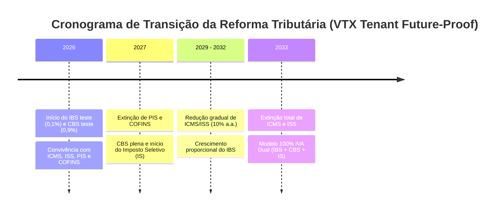

# Especificação Técnica e Arquitetural — Sistema Fiscal do Tenant (`VTX Tenant`)
## Módulo Fiscal Multi-Tenant com Suporte Nativo à Nova Reforma Tributária (IBS / CBS / IS)

| Metadado | Detalhe |
|---|---|
| **Projeto** | `VTX Tenant — Módulo Fiscal Multi-Tenant` |
| **Documento** | Especificação Técnica, Modelagem de Dados e Arquitetura de Integração |
| **Papel do Emissor** | Product Owner (PO) & Arquiteto de Soluções |
| **Data de Emissão** | 11/09/2026 |
| **Marco Regulatório** | EC 132/2023, PLP 68/2024 e Notas Técnicas da SEFAZ (IVA Dual: IBS / CBS / IS) |
| **Sistema Integrador** | `VTX Core` (`MateusBrito-hub/project-vtx`) |
| **Status** | 🚀 **Documento Base e Future-Proof para a Fase 2** |

---

## 1. Visão Geral e Alinhamento com a Nova Reforma Tributária

O **VTX Core** gerencia o provisionamento dos bancos dedicados (`vtx_<slug>`) e controla quotas de documentos (`maxDocs`). Para que o **VTX Tenant** seja comercialmente viável, moderno e com longevidade operacional, ele foi desenhado para atender **tanto o modelo tributário vigente quanto o novo modelo da Reforma Tributária (Emenda Constitucional 132/2023 e PLP 68/2024)**.

### 1.1. O Cronograma da Reforma e o Modelo Híbrido de Transição
A transição tributária brasileira exige que sistemas emissores suportem a **coexistência tributária**:
* **2026 (Ano de Teste/Calibração):** Início da cobrança teste da CBS (0,9%) e do IBS (0,1%), compensáveis em PIS/COFINS, enquanto ICMS e ISS continuam operando normalmente.
* **2027 (Extinção de PIS/COFINS):** Extinção definitiva do PIS e da COFINS; vigência integral da **CBS (Federal)** e introdução do **Imposto Seletivo (IS)**; alíquota zero de IPI para produtos sem similar na ZFM.
* **2029 a 2032 (Transição Gradual do ICMS/ISS para o IBS):** Redução progressiva de 10% ao ano nas alíquotas de ICMS e ISS, com aumento proporcional do **IBS (Estadual e Municipal)**.
* **2033 em diante:** Vigência plena e exclusiva do **IVA Dual (IBS + CBS)** e do **Imposto Seletivo (IS)**. Extinção total de ICMS e ISS.



---

## 2. Pilares da Reforma Tributária no Motor Fiscal do Tenant

1. **IVA Dual Não Cumulativo Pleno:**
   - **CBS (Contribuição sobre Bens e Serviços):** Competência Federal (substitui PIS e COFINS).
   - **IBS (Imposto sobre Bens e Serviços):** Competência Compartilhada entre Estados e Municípios (substitui ICMS e ISS).
2. **Imposto Seletivo (IS):**
   - Incidência monofásica sobre produtos prejudiciais à saúde ou ao meio ambiente (bebidas alcoólicas, cigarros, veículos, etc.).
3. **Princípio da Tributação no Destino:**
   - O imposto não pertence mais ao local de produção/sede do emitente, mas sim ao **município e estado onde o bem é consumido ou o serviço é prestado**. Exige validação mandatória do código IBGE do local de entrega/consumo.
4. **Mecanismo de Split Payment:**
   - A liquidação financeira via arranjos de pagamento (PIX, cartões de crédito/débito, boletos) realiza a retenção e recolhimento instantâneo da CBS e do IBS no ato da transação, exigindo vínculos detalhados no grupo de pagamentos da nota fiscal.

---

## 3. Modelagem de Dados do Banco Dedicado (`vtx_<slug>`) Adaptada à Reforma

O schema do tenant foi estruturado para ser **nativamente híbrido**: suporta os campos de ICMS/PIS/COFINS e já possui a modelagem estrita para **IBS, CBS, IS e Split Payment**.

```prisma
datasource db {
  provider = "postgresql"
}

generator client {
  provider = "prisma-client-js"
  output   = "./generated/tenant-client"
}

// -------------------------------------------------------------
// 1. Configuração Fiscal da Empresa Emitente
// -------------------------------------------------------------
enum EnvironmentType {
  HOMOLOGATION
  PRODUCTION
}

enum TaxRegime {
  SIMPLES_NACIONAL             // CRT 1 (Regime simplificado com opção de apuração de IBS/CBS)
  SIMPLES_EXCESSO_SUBLIMITE    // CRT 2
  REGIME_NORMAL                // CRT 3 (Não cumulativo pleno de IBS/CBS)
}

model FiscalConfig {
  id                    Int             @id @default(autoincrement())
  environment           EnvironmentType @default(HOMOLOGATION)
  taxRegime             TaxRegime       @default(SIMPLES_NACIONAL)
  
  // Habilita cálculo dos novos tributos da Reforma (IBS / CBS / IS)
  enableTaxReform       Boolean         @default(true)

  // Controle de Séries e Numerações
  nfeSeries             Int             @default(1)
  nfeNextNumber         Int             @default(1)
  nfceSeries            Int             @default(1)
  nfceNextNumber        Int             @default(1)

  // Certificado Digital A1 (Criptografia AES-256-GCM em Repouso)
  certificatePfxBase64  String          
  certificatePasswordEnc String         
  certificateExpiresAt  DateTime        
  certificateCnpj       String          

  // Configurações de NFC-e (Código de Segurança do Contribuinte)
  cscIdToken            String?         
  cscToken              String?         

  createdAt             DateTime        @default(now())
  updatedAt             DateTime        @updatedAt
}

// -------------------------------------------------------------
// 2. Cadastro de Clientes / Destinatários (Princípio do Destino)
// -------------------------------------------------------------
model Customer {
  id              Int              @id @default(autoincrement())
  cpfCnpj         String           @unique
  name            String
  fantasyName     String?
  ie              String?          
  indicadorIe     Int              @default(9) 
  email           String?
  phone           String?

  // Endereço Fiscal de Destino (Crucial para Partilha do IBS Estadual/Municipal)
  street          String
  number          String
  complement      String?
  district        String
  cityCode        String           // Código IBGE de 7 dígitos (determina o IBS Municipal)
  cityName        String
  uf              String           // Sigla da UF (determina o IBS Estadual)
  zipCode         String

  documents       FiscalDocument[]
  createdAt       DateTime         @default(now())
  updatedAt       DateTime         @updatedAt
}

// -------------------------------------------------------------
// 3. Catálogo de Produtos e Regras Fiscais da Reforma
// -------------------------------------------------------------
enum TaxReformClass {
  PADRAO               // Alíquota cheia (IBS + CBS)
  REDUZIDA_60          // Redução de 60% (saúde, educação, dispositivos médicos)
  REDUZIDA_30          // Redução de 30% (profissões regulamentadas)
  CESTA_BASICA_ISENTA  // Cesta Básica Nacional (Alíquota zero de IBS/CBS)
  IMPOSTO_SELETIVO     // Sujeito ao Imposto Seletivo ("Imposto do Pecado")
  IMUNE_ISENTO         // Livros, exportações, imunidades constitucionais
}

model Product {
  id              Int                  @id @default(autoincrement())
  sku             String               @unique
  description     String
  ncm             String               // 8 dígitos (Nomenclatura Comum do Mercosul)
  cest            String?              // 7 dígitos (Substituição Tributária)
  unit            String               // Ex: "UN", "KG", "CX"
  price           Decimal              @db.Decimal(12, 2)
  ean             String?              // Código de barras EAN-13 / GTIN
  cfopDefault     String               

  // Classificação na Reforma Tributária
  taxReformClass  TaxReformClass       @default(PADRAO)
  isSubjectToIS   Boolean              @default(false) // Incidência de Imposto Seletivo
  cstIbsCbsDefault String?             @default("01")  // CST padrão do IBS/CBS

  items           FiscalDocumentItem[]
  createdAt       DateTime             @default(now())
  updatedAt       DateTime             @updatedAt
}

// -------------------------------------------------------------
// 4. Documentos Fiscais Eletrônicos (Totais com IVA Dual)
// -------------------------------------------------------------
enum DocumentModel {
  NFE_55  // Nota Fiscal Eletrônica (NF-e)
  NFCE_65 // Nota Fiscal de Consumidor Eletrônica (NFC-e)
}

enum DocumentStatus {
  DRAFT
  VALIDATED
  SIGNED
  TRANSMITTING
  AUTHORIZED
  REJECTED
  CANCELED
  DENIED
}

model FiscalDocument {
  id              Int                  @id @default(autoincrement())
  model           DocumentModel        @default(NFE_55)
  series          Int
  number          Int
  accessKey       String?              @unique // 44 dígitos
  naturezaOp      String               @default("VENDA DE MERCADORIA")
  tipoOp          Int                  @default(1) // 0 = Entrada, 1 = Saída
  status          DocumentStatus       @default(DRAFT)
  
  emissionDate    DateTime             @default(now())
  authorizationDate DateTime?

  customerId      Int?
  customer        Customer?            @relation(fields: [customerId], references: [id])

  // Valores Comerciais
  totalProducts   Decimal              @db.Decimal(12, 2)
  totalDiscount   Decimal              @default(0) @db.Decimal(12, 2)
  totalInvoice    Decimal              @db.Decimal(12, 2)

  // -----------------------------------------------------------
  // Tributos Legados (Período de Transição até 2032)
  // -----------------------------------------------------------
  totalTaxIcms    Decimal              @default(0) @db.Decimal(12, 2)
  totalTaxPis     Decimal              @default(0) @db.Decimal(12, 2)
  totalTaxCofins  Decimal              @default(0) @db.Decimal(12, 2)
  totalTaxIpi     Decimal              @default(0) @db.Decimal(12, 2)

  // -----------------------------------------------------------
  // Novos Tributos da Reforma Tributária (IBS / CBS / IS)
  // -----------------------------------------------------------
  totalIbsEstadual Decimal             @default(0) @db.Decimal(12, 2) // Parcela Estadual do IBS
  totalIbsMunicipal Decimal            @default(0) @db.Decimal(12, 2) // Parcela Municipal do IBS
  totalIbs        Decimal              @default(0) @db.Decimal(12, 2) // Total Consolidado do IBS
  totalCbs        Decimal              @default(0) @db.Decimal(12, 2) // Total Consolidado da CBS (Federal)
  totalIS         Decimal              @default(0) @db.Decimal(12, 2) // Total do Imposto Seletivo

  // Metadados SEFAZ
  protocolNumber  String?              
  cStat           String?              
  xMotivo         String?              
  xmlSigned       String?              @db.Text 
  xmlDistribution String?              @db.Text 

  items           FiscalDocumentItem[]
  events          FiscalEvent[]
  payments        FiscalPayment[]

  createdAt       DateTime             @default(now())
  updatedAt       DateTime             @updatedAt

  @@unique([model, series, number])
}

// -------------------------------------------------------------
// 5. Itens do Documento Fiscal com Detalhamento de IBS / CBS / IS
// -------------------------------------------------------------
model FiscalDocumentItem {
  id              Int            @id @default(autoincrement())
  documentId      Int
  productId       Int
  itemIndex       Int            
  
  description     String
  cfop            String
  ncm             String
  quantity        Decimal        @db.Decimal(12, 4)
  unitPrice       Decimal        @db.Decimal(12, 4)
  totalValue      Decimal        @db.Decimal(12, 2)
  discountValue   Decimal        @default(0) @db.Decimal(12, 2)

  // Tributos Legados (ICMS, PIS, COFINS)
  cstCsosn        String
  origem          Int            @default(0)
  icmsBase        Decimal        @default(0) @db.Decimal(12, 2)
  icmsRate        Decimal        @default(0) @db.Decimal(5, 2)
  icmsValue       Decimal        @default(0) @db.Decimal(12, 2)
  pisCst          String?        @default("99")
  cofinsCst       String?        @default("99")

  // -----------------------------------------------------------
  // Reforma Tributária: Grupo IBS / CBS (Nota Técnica SEFAZ)
  // -----------------------------------------------------------
  cstIbsCbs       String?        @default("01") // Código de Situação Tributária IBS/CBS
  
  // CBS (Contribuição sobre Bens e Serviços - Federal)
  cbsBase         Decimal        @default(0) @db.Decimal(12, 2)
  cbsRate         Decimal        @default(0) @db.Decimal(5, 2)
  cbsValue        Decimal        @default(0) @db.Decimal(12, 2)

  // IBS Estadual (Destino - UF)
  ibsUfBase       Decimal        @default(0) @db.Decimal(12, 2)
  ibsUfRate       Decimal        @default(0) @db.Decimal(5, 2)
  ibsUfValue      Decimal        @default(0) @db.Decimal(12, 2)

  // IBS Municipal (Destino - Município)
  ibsMunBase      Decimal        @default(0) @db.Decimal(12, 2)
  ibsMunRate      Decimal        @default(0) @db.Decimal(5, 2)
  ibsMunValue     Decimal        @default(0) @db.Decimal(12, 2)

  // Imposto Seletivo (IS - Quando aplicável)
  isBase          Decimal        @default(0) @db.Decimal(12, 2)
  isRate          Decimal        @default(0) @db.Decimal(5, 2)
  isSpecificUnit  Decimal?       @db.Decimal(12, 4) // Alíquota específica por unidade (ad rem)
  isValue         Decimal        @default(0) @db.Decimal(12, 2)

  document        FiscalDocument @relation(fields: [documentId], references: [id], onDelete: Cascade)
  product         Product        @relation(fields: [productId], references: [id])
}

// -------------------------------------------------------------
// 6. Pagamentos e Split Payment (Liquidação Concomitante)
// -------------------------------------------------------------
enum PaymentMethod {
  DINHEIRO
  PIX
  CARTAO_CREDITO
  CARTAO_DEBITO
  BOLETO
  TRANSFERENCIA
  OUTROS
}

model FiscalPayment {
  id              Int            @id @default(autoincrement())
  documentId      Int
  method          PaymentMethod
  amount          Decimal        @db.Decimal(12, 2)
  
  // Campos de Integração para Split Payment
  splitPaymentActive Boolean     @default(false)
  splitIbsAmount  Decimal?       @db.Decimal(12, 2) // Parcela retida de IBS
  splitCbsAmount  Decimal?       @db.Decimal(12, 2) // Parcela retida de CBS
  paymentProviderCnpj String?    // CNPJ da Instituição de Pagamento / Banco
  transactionAuth String?        // Código de autorização da maquininha/gateway

  document        FiscalDocument @relation(fields: [documentId], references: [id], onDelete: Cascade)
}

// -------------------------------------------------------------
// 7. Eventos Fiscais
// -------------------------------------------------------------
enum EventType {
  CANCELAMENTO
  CARTA_CORRECAO
  INUTILIZACAO
}

model FiscalEvent {
  id              Int            @id @default(autoincrement())
  documentId      Int
  type            EventType
  sequenceNumber  Int            @default(1)
  reason          String         
  protocolNumber  String?
  cStat           String?
  xMotivo         String?
  xmlSigned       String?        @db.Text
  xmlRetorno      String?        @db.Text
  createdAt       DateTime       @default(now())

  document        FiscalDocument @relation(fields: [documentId], references: [id], onDelete: Cascade)
}
```

---

## 4. Adaptação do XML da SEFAZ para a Reforma (Notas Técnicas NF-e)

A estrutura XML gerada pelo motor fiscal do `VTX Tenant` passará a emitir os novos grupos de tributação definidos nos manuais da SEFAZ:

```xml
<det nItem="1">
    <prod>
        <cProd>SKU-001</cProd>
        <xProd>Produto Exemplo com CBS e IBS</xProd>
        <NCM>84713012</NCM>
        <CFOP>5102</CFOP>
        <uCom>UN</uCom>
        <qCom>1.0000</qCom>
        <vUnCom>1000.00</vUnCom>
        <vProd>1000.00</vProd>
    </prod>
    <imposto>
        <!-- Tributos em Transição (ICMS/PIS/COFINS) -->
        <ICMS>...</ICMS>
        <PIS>...</PIS>
        <COFINS>...</COFINS>

        <!-- Novos Tributos da Reforma Tributária -->
        <CBS>
            <CST>01</CST>
            <vBC>1000.00</vBC>
            <pCBS>8.80</pCBS>
            <vCBS>88.00</vCBS>
        </CBS>
        <IBS>
            <CST>01</CST>
            <!-- Parcela Estadual Destino (ex: SP 12%) -->
            <vBCIBSUF>1000.00</vBCIBSUF>
            <pIBSUF>12.00</pIBSUF>
            <vIBSUF>120.00</vIBSUF>
            <!-- Parcela Municipal Destino (ex: Campinas 5%) -->
            <vBCIBSMun>1000.00</vBCIBSMun>
            <pIBSMun>5.00</pIBSMun>
            <vIBSMun>50.00</vIBSMun>
        </IBS>
        <!-- Imposto Seletivo (se aplicável) -->
        <!-- <IS><CST>01</CST><vBC>1000.00</vBC><pIS>1.50</pIS><vIS>15.00</vIS></IS> -->
    </imposto>
</det>
```

---

## 5. Benefícios Competitivos da Arquitetura Adotada

1. **Zero Dívida Técnica Tributária:** Ao nascer com suporte nativo ao IVA Dual, o `VTX Tenant` não exigirá reescritas traumáticas de código ou migrações de banco emergenciais em 2026/2027.
2. **Motor Tributário Parametrizável:** Um switch (`enableTaxReform: true/false`) permite que o tenant opere apenas com o modelo legado em ambientes legados, ou ative os novos cálculos de IBS/CBS/IS instantaneamente.
3. **Prontidão para Split Payment:** A modelagem financeira (`FiscalPayment`) já vincula o imposto retido ao meio de pagamento eletrônico, atendendo à maior inovação operacional da Reforma.
4. **Isolamento e Segurança Multi-Tenant:** Toda a apuração tributária sensível reside no banco PostgreSQL dedicado do cliente (`vtx_<slug>`), mantendo o `VTX Core` focado em faturamento, quotas (`maxDocs`) e controle de acesso.

---

## 6. Homologação da Especificação

Este documento consolida o alinhamento da engenharia de software com o novo sistema tributário brasileiro, servindo como guia mestre para o desenvolvimento da **Fase 2 (VTX Tenant)**.
