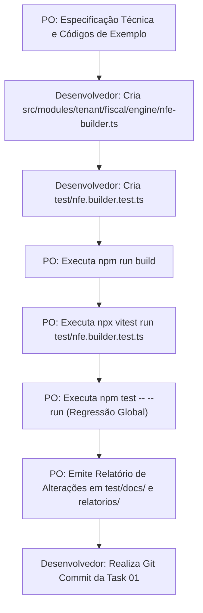

# Plano de Implementação — TASK 01 (Sprint 3 - Tenant)
## Construtor do XML NF-e (Modelo 55) Padrão PL_009_V4 com Reforma Tributária

| Metadado | Detalhe |
|---|---|
| **Fase** | 2 — VTX Tenant (Sistema Fiscal Cloud Multi-Filial) |
| **Sprint** | 3 — Geração de XML PL_009_V4, QR-Code 2.0 e Assinador Digital Nativo XMLDSig |
| **Task** | 01 — Construtor do XML NF-e (Modelo 55) Padrão PL_009_V4 com Reforma Tributária |
| **Papel do PO** | Especificação de requisitos, fórmulas, auditoria de código, testes e relatórios |
| **Papel do Desenvolvedor** | Codificação de `src/modules/tenant/fiscal/engine/nfe-builder.ts` e `test/nfe.builder.test.ts` |
| **Padrão Normativo** | MOC SEFAZ v4.00, Minuta PL_009_V4, EC 132/2023, PLP 68/2024 |

---

## 1. Diretrizes Arquiteturais e Governança

1. **Separação Rígida de Papéis:**
   * O **Product Owner (PO)** especifica os requisitos de negócio, arquitetura, fórmulas matemáticas, interfaces e critérios de aceite, audita os resultados, executa os comandos de teste/build e emite os relatórios formais em `test/docs/` e `relatorios/`.
   * O **Desenvolvedor (Usuário)** implementa o código-fonte em `src/` e os arquivos de teste em `test/`.
2. **Padrão de Validação em Tempo de Execução:**
   * Utilização exclusiva de **Zod DTOs com `.strict()`**, rejeitando campos desconhecidos, dados negativos ou malformados.
3. **Padrão de Autonomia:**
   * Geração nativa pura em TypeScript/Node.js sem acoplamento a bibliotecas pesadas de terceiros ou gateways de emissão.

---

## 2. Arquitetura e Arquivos Envolvidos

| Tipo | Caminho | Responsável | Descrição |
|:---:|---|:---:|---|
| **[NEW]** | `src/modules/tenant/fiscal/engine/nfe-builder.ts` | Desenvolvedor | Construtor do XML da NF-e v4.00 com nós da Reforma Tributária e gerador de chave de acesso |
| **[NEW]** | `test/nfe.builder.test.ts` | Desenvolvedor | Suíte de testes unitários cobrindo Módulo 11, estrutura XML, Reforma Tributária e sanitização |
| **[NEW]** | `test/docs/plano-implementacao-task-01-sprint-3-tenant.md` | PO | Documento canônico do plano de implementação da Task 01 com códigos de exemplo |
| **[NEW]** | `relatorios/plano-implementacao-task-01-sprint-3-tenant.md` | PO | Espelho do plano de implementação na pasta de relatórios |
| **[NEW]** | `test/docs/relatorio-alteracoes-task-01-sprint-3-tenant.md` | PO | Relatório formal de conformidade de 10 seções (pós-execução) |
| **[NEW]** | `relatorios/relatorio-alteracoes-task-01-sprint-3-tenant.md` | PO | Espelho do relatório formal na pasta de relatórios |

---

## 3. Especificação Técnica Detalhada

### 3.1. Mapeamento de Códigos IBGE de UF (`UF_TO_CUF`)
```typescript
export const UF_TO_CUF: Record<string, string> = {
    AC: '12', AL: '27', AP: '16', AM: '13', BA: '29', CE: '23', DF: '53', ES: '32',
    GO: '52', MA: '21', MT: '51', MS: '50', MG: '31', PA: '15', PB: '25', PR: '41',
    PE: '26', PI: '22', RJ: '33', RN: '24', RS: '43', RO: '11', RR: '14', SC: '42',
    SP: '35', SE: '28', TO: '17'
}
```

### 3.2. Algoritmo do Módulo 11 (`calculateModulo11`)
```typescript
export function calculateModulo11(base43: string): number {
    if (!/^\d{43}$/.test(base43)) {
        throw new Error('Base for Modulo 11 must have exactly 43 numeric digits')
    }

    let sum = 0
    let weight = 2

    for (let i = base43.length - 1; i >= 0; i--) {
        const digit = parseInt(base43[i], 10)
        sum += digit * weight
        weight = weight === 9 ? 2 : weight + 1
    }

    const remainder = sum % 11
    if (remainder === 0 || remainder === 1) {
        return 0
    }
    return 11 - remainder
}
```

### 3.3. Gerador da Chave de Acesso (`generateAccessKey`)
Formato:
$$\text{cUF (2)} + \text{AAMM (4)} + \text{CNPJ (14)} + \text{mod (2)} + \text{serie (3)} + \text{nNF (9)} + \text{tpEmis (1)} + \text{cNF (8)} + \text{cDV (1)}$$

---

## 4. Códigos de Exemplo e Referência para Implementação

### 4.1. Código de Referência: `src/modules/tenant/fiscal/engine/nfe-builder.ts`

```typescript
import { z } from 'zod'
import { calculateItemTaxes, taxReformClassEnum } from './tax-calculator'

// 1. Tabela de Códigos IBGE das UFs Brasileiras
export const UF_TO_CUF: Record<string, string> = {
    AC: '12', AL: '27', AP: '16', AM: '13', BA: '29', CE: '23', DF: '53', ES: '32',
    GO: '52', MA: '21', MT: '51', MS: '50', MG: '31', PA: '15', PB: '25', PR: '41',
    PE: '26', PI: '22', RJ: '33', RN: '24', RS: '43', RO: '11', RR: '14', SC: '42',
    SP: '35', SE: '28', TO: '17'
}

// 2. Cálculo do Dígito Verificador via Módulo 11 Ponderado (Pesos 2 a 9)
export function calculateModulo11(base43: string): number {
    if (!/^\d{43}$/.test(base43)) {
        throw new Error('Base for Modulo 11 must have exactly 43 numeric digits')
    }

    let sum = 0
    let weight = 2

    for (let i = base43.length - 1; i >= 0; i--) {
        const digit = parseInt(base43[i], 10)
        sum += digit * weight
        weight = weight === 9 ? 2 : weight + 1
    }

    const remainder = sum % 11
    if (remainder === 0 || remainder === 1) {
        return 0
    }
    return 11 - remainder
}

// 3. Gerador da Chave de Acesso da NF-e (44 dígitos)
export interface AccessKeyParams {
    uf: string
    emissionDate: Date
    cnpj: string
    model?: string // Padrão '55'
    series: number
    number: number
    tpEmis?: number // Padrão 1
    cNF?: string
}

export function generateAccessKey(params: AccessKeyParams): { accessKey: string; cDV: number; cNF: string } {
    const cUF = UF_TO_CUF[params.uf.toUpperCase()]
    if (!cUF) {
        throw new Error(`Invalid UF for access key generation: ${params.uf}`)
    }

    const year = params.emissionDate.getFullYear().toString().slice(-2)
    const month = (params.emissionDate.getMonth() + 1).toString().padStart(2, '0')
    const aamm = `${year}${month}`

    const cnpjDigits = params.cnpj.replace(/\D/g, '')
    if (cnpjDigits.length !== 14) {
        throw new Error(`CNPJ must contain 14 digits, received: ${params.cnpj}`)
    }

    const mod = (params.model || '55').padStart(2, '0')
    const serie = params.series.toString().padStart(3, '0')
    const nNF = params.number.toString().padStart(9, '0')
    const tpEmis = (params.tpEmis || 1).toString()

    const cNF = params.cNF
        ? params.cNF.padStart(8, '0')
        : Math.floor(10000000 + Math.random() * 90000000).toString()

    const base43 = `${cUF}${aamm}${cnpjDigits}${mod}${serie}${nNF}${tpEmis}${cNF}`
    const cDV = calculateModulo11(base43)
    const accessKey = `${base43}${cDV}`

    return { accessKey, cDV, cNF }
}

// 4. Sanitização e Escape XML
export function xmlEscape(str: string): string {
    return str
        .replace(/&/g, '&amp;')
        .replace(/</g, '&lt;')
        .replace(/>/g, '&gt;')
        .replace(/"/g, '&quot;')
        .replace(/'/g, '&apos;')
        .trim()
}

// 5. Schemas Zod de Validação (DTOs)
export const nfeCompanySchema = z.object({
    cnpj: z.string().regex(/^\d{14}$/, 'CNPJ must be 14 numeric digits'),
    socialName: z.string().min(2).max(60),
    fantasyName: z.string().max(60).optional(),
    ie: z.string().min(2).max(14),
    crt: z.enum(['1', '2', '3']).default('1'),
    street: z.string().min(2).max(60),
    number: z.string().min(1).max(60),
    complement: z.string().max(60).optional(),
    district: z.string().min(2).max(60),
    cityCode: z.string().regex(/^\d{7}$/, 'City code must be 7-digit IBGE code'),
    cityName: z.string().min(2).max(60),
    uf: z.string().length(2).toUpperCase(),
    zipCode: z.string().regex(/^\d{8}$/, 'ZipCode must be 8 digits'),
    phone: z.string().max(14).optional()
}).strict()

export const nfeCustomerSchema = z.object({
    cpfCnpj: z.string().regex(/^(\d{11}|\d{14})$/, 'CPF/CNPJ must be 11 or 14 digits'),
    name: z.string().min(2).max(60),
    indicadorIe: z.number().int().min(1).max(9).default(9),
    ie: z.string().max(14).optional(),
    street: z.string().min(2).max(60),
    number: z.string().min(1).max(60),
    complement: z.string().max(60).optional(),
    district: z.string().min(2).max(60),
    cityCode: z.string().regex(/^\d{7}$/, 'City code must be 7-digit IBGE code'),
    cityName: z.string().min(2).max(60),
    uf: z.string().length(2).toUpperCase(),
    zipCode: z.string().regex(/^\d{8}$/, 'ZipCode must be 8 digits'),
    email: z.string().email().optional()
}).strict()

export const nfeItemInputSchema = z.object({
    sku: z.string().min(1).max(60),
    description: z.string().min(1).max(120),
    ncm: z.string().regex(/^\d{8}$/, 'NCM must be 8 digits'),
    cest: z.string().regex(/^\d{7}$/).optional(),
    cfop: z.string().regex(/^\d{4}$/, 'CFOP must be 4 digits'),
    unit: z.string().min(1).max(6),
    quantity: z.number().positive(),
    unitPrice: z.number().positive(),
    discount: z.number().nonnegative().optional().default(0),
    taxReformClass: taxReformClassEnum.optional().default('PADRAO'),
    isSubjectToIS: z.boolean().optional().default(false),
    customRates: z.object({
        aliqIbsEstadual: z.number().nonnegative().optional(),
        aliqIbsMunicipal: z.number().nonnegative().optional(),
        aliqCbs: z.number().nonnegative().optional(),
        aliqIS: z.number().nonnegative().optional()
    }).optional()
}).strict()

export const nfePaymentSchema = z.object({
    tPag: z.string().regex(/^\d{2}$/, 'Payment code must be 2 digits (e.g. 01, 03, 17)'),
    vPag: z.number().positive('Payment amount must be positive')
}).strict()

export const nfeInputSchema = z.object({
    series: z.number().int().positive().default(1),
    number: z.number().int().positive(),
    naturezaOp: z.string().default('VENDA DE MERCADORIA'),
    tipoOp: z.union([z.literal(0), z.literal(1)]).default(1),
    tpAmb: z.union([z.literal(1), z.literal(2)]).default(2),
    tpEmis: z.union([z.literal(1), z.literal(9)]).default(1),
    emissionDate: z.date().optional(),
    cNF: z.string().regex(/^\d{8}$/).optional(),
    company: nfeCompanySchema,
    customer: nfeCustomerSchema,
    items: z.array(nfeItemInputSchema).min(1, 'NF-e must have at least one item'),
    payments: z.array(nfePaymentSchema).min(1, 'NF-e must have at least one payment'),
    additionalInfo: z.string().max(2000).optional()
}).strict()

export type NFeInputDTO = z.infer<typeof nfeInputSchema>

export interface NFeBuildResult {
    xml: string
    accessKey: string
    cDV: number
    cNF: string
    totalInvoice: number
    totalIbs: number
    totalCbs: number
    totalIS: number
}

// 6. Construtor Principal do XML
export function buildNFeXml(rawInput: unknown): NFeBuildResult {
    const input = nfeInputSchema.parse(rawInput)
    const emissionDate = input.emissionDate || new Date()
    const { accessKey, cDV, cNF } = generateAccessKey({
        uf: input.company.uf,
        emissionDate,
        cnpj: input.company.cnpj,
        model: '55',
        series: input.series,
        number: input.number,
        tpEmis: input.tpEmis,
        cNF: input.cNF
    })

    const cUF = UF_TO_CUF[input.company.uf]
    const idDest = input.company.uf === input.customer.uf ? '1' : '2'
    const isCustomerPJ = input.customer.cpfCnpj.length === 14
    const dhEmiIso = emissionDate.toISOString().replace(/\.\d{3}Z$/, '-03:00')

    let totalProducts = 0
    let totalDiscount = 0
    let totalIbsEstadual = 0
    let totalIbsMunicipal = 0
    let totalIbs = 0
    let totalCbs = 0
    let totalIS = 0
    let totalTrib = 0

    const itemsXml = input.items.map((item, index) => {
        const itemNumber = index + 1
        const taxResult = calculateItemTaxes({
            quantity: item.quantity,
            unitPrice: item.unitPrice,
            discount: item.discount,
            taxReformClass: item.taxReformClass,
            isSubjectToIS: item.isSubjectToIS,
            destinationUf: input.customer.uf,
            destinationCityCode: input.customer.cityCode,
            customRates: item.customRates
        })

        const itemTotalGross = item.quantity * item.unitPrice
        totalProducts += itemTotalGross
        totalDiscount += item.discount
        totalIbsEstadual += taxResult.taxReform.valorIbsEstadual
        totalIbsMunicipal += taxResult.taxReform.valorIbsMunicipal
        totalIbs += taxResult.taxReform.valorIbsTotal
        totalCbs += taxResult.taxReform.valorCbs
        totalIS += taxResult.taxReform.valorIS
        totalTrib += taxResult.taxReform.totalTaxReform

        return `
    <det nItem="${itemNumber}">
      <prod>
        <cProd>${xmlEscape(item.sku)}</cProd>
        <cEAN>SEM GTIN</cEAN>
        <xProd>${xmlEscape(item.description)}</xProd>
        <NCM>${item.ncm}</NCM>
        ${item.cest ? `<CEST>${item.cest}</CEST>` : ''}
        <CFOP>${item.cfop}</CFOP>
        <uCom>${xmlEscape(item.unit)}</uCom>
        <qCom>${item.quantity.toFixed(4)}</qCom>
        <vUnCom>${item.unitPrice.toFixed(4)}</vUnCom>
        <vProd>${itemTotalGross.toFixed(2)}</vProd>
        <cEANTrib>SEM GTIN</cEANTrib>
        <uTrib>${xmlEscape(item.unit)}</uTrib>
        <qTrib>${item.quantity.toFixed(4)}</qTrib>
        <vUnTrib>${item.unitPrice.toFixed(4)}</vUnTrib>
        ${item.discount > 0 ? `<vDesc>${item.discount.toFixed(2)}</vDesc>` : ''}
        <indTot>1</indTot>
      </prod>
      <imposto>
        <vTotTrib>${taxResult.taxReform.totalTaxReform.toFixed(2)}</vTotTrib>
        <ICMS>
          <ICMSSN102>
            <orig>0</orig>
            <CSOSN>102</CSOSN>
          </ICMSSN102>
        </ICMS>
        <PIS>
          <PISNT>
            <CST>07</CST>
          </PISNT>
        </PIS>
        <COFINS>
          <COFINSNT>
            <CST>07</CST>
          </COFINSNT>
        </COFINS>
        <IBS>
          <cstIBS>${taxResult.taxReform.cstIbsCbs}</cstIBS>
          <vBC>${taxResult.taxReform.baseIbs.toFixed(2)}</vBC>
          <pIBSUF>${taxResult.taxReform.aliqIbsEstadual.toFixed(2)}</pIBSUF>
          <vIBSUF>${taxResult.taxReform.valorIbsEstadual.toFixed(2)}</vIBSUF>
          <pIBSMun>${taxResult.taxReform.aliqIbsMunicipal.toFixed(2)}</pIBSMun>
          <vIBSMun>${taxResult.taxReform.valorIbsMunicipal.toFixed(2)}</vIBSMun>
          <vIBS>${taxResult.taxReform.valorIbsTotal.toFixed(2)}</vIBS>
        </IBS>
        <CBS>
          <cstCBS>${taxResult.taxReform.cstIbsCbs}</cstCBS>
          <vBC>${taxResult.taxReform.baseCbs.toFixed(2)}</vBC>
          <pCBS>${taxResult.taxReform.aliqCbs.toFixed(2)}</pCBS>
          <vCBS>${taxResult.taxReform.valorCbs.toFixed(2)}</vCBS>
        </CBS>
        ${taxResult.taxReform.valorIS > 0 ? `
        <IS>
          <vBC>${taxResult.taxReform.baseIS.toFixed(2)}</vBC>
          <pIS>${taxResult.taxReform.aliqIS.toFixed(2)}</pIS>
          <vIS>${taxResult.taxReform.valorIS.toFixed(2)}</vIS>
        </IS>` : ''}
      </imposto>
    </det>`
    }).join('')

    const totalInvoice = totalProducts - totalDiscount

    const paymentsXml = input.payments.map((p) => `
      <detPag>
        <tPag>${p.tPag}</tPag>
        <vPag>${p.vPag.toFixed(2)}</vPag>
      </detPag>`).join('')

    const infCpl = input.additionalInfo
        ? `${xmlEscape(input.additionalInfo)} - Valores calculados conforme EC 132/2023.`
        : 'Valores de tributos apurados de acordo com a Reforma Tributária (EC 132/2023).'

    const xml = `<NFe xmlns="http://www.portalfiscal.inf.br/nfe">
  <infNFe Id="NFe${accessKey}" versao="4.00">
    <ide>
      <cUF>${cUF}</cUF>
      <cNF>${cNF}</cNF>
      <natOp>${xmlEscape(input.naturezaOp)}</natOp>
      <mod>55</mod>
      <serie>${input.series}</serie>
      <nNF>${input.number}</nNF>
      <dhEmi>${dhEmiIso}</dhEmi>
      <tpNF>${input.tipoOp}</tpNF>
      <idDest>${idDest}</idDest>
      <cMunFG>${input.company.cityCode}</cMunFG>
      <tpImp>1</tpImp>
      <tpEmis>${input.tpEmis}</tpEmis>
      <cDV>${cDV}</cDV>
      <tpAmb>${input.tpAmb}</tpAmb>
      <finNFe>1</finNFe>
      <indFinal>1</indFinal>
      <indPres>1</indPres>
      <procEmi>0</procEmi>
      <verProc>VTX_1.0</verProc>
    </ide>
    <emit>
      <CNPJ>${input.company.cnpj}</CNPJ>
      <xNome>${xmlEscape(input.company.socialName)}</xNome>
      ${input.company.fantasyName ? `<xFant>${xmlEscape(input.company.fantasyName)}</xFant>` : ''}
      <enderEmit>
        <xLgr>${xmlEscape(input.company.street)}</xLgr>
        <nro>${xmlEscape(input.company.number)}</nro>
        ${input.company.complement ? `<xCpl>${xmlEscape(input.company.complement)}</xCpl>` : ''}
        <xBairro>${xmlEscape(input.company.district)}</xBairro>
        <cMun>${input.company.cityCode}</cMun>
        <xMun>${xmlEscape(input.company.cityName)}</xMun>
        <UF>${input.company.uf}</UF>
        <CEP>${input.company.zipCode}</CEP>
        <cPais>1058</cPais>
        <xPais>Brasil</xPais>
        ${input.company.phone ? `<fone>${input.company.phone}</fone>` : ''}
      </enderEmit>
      <IE>${input.company.ie}</IE>
      <CRT>${input.company.crt}</CRT>
    </emit>
    <dest>
      ${isCustomerPJ ? `<CNPJ>${input.customer.cpfCnpj}</CNPJ>` : `<CPF>${input.customer.cpfCnpj}</CPF>`}
      <xNome>${xmlEscape(input.customer.name)}</xNome>
      <enderDest>
        <xLgr>${xmlEscape(input.customer.street)}</xLgr>
        <nro>${xmlEscape(input.customer.number)}</nro>
        ${input.customer.complement ? `<xCpl>${xmlEscape(input.customer.complement)}</xCpl>` : ''}
        <xBairro>${xmlEscape(input.customer.district)}</xBairro>
        <cMun>${input.customer.cityCode}</cMun>
        <xMun>${xmlEscape(input.customer.cityName)}</xMun>
        <UF>${input.customer.uf}</UF>
        <CEP>${input.customer.zipCode}</CEP>
        <cPais>1058</cPais>
        <xPais>Brasil</xPais>
      </enderDest>
      <indIEDest>${input.customer.indicadorIe}</indIEDest>
      ${input.customer.ie ? `<IE>${input.customer.ie}</IE>` : ''}
      ${input.customer.email ? `<email>${xmlEscape(input.customer.email)}</email>` : ''}
    </dest>${itemsXml}
    <total>
      <ICMSTot>
        <vBC>0.00</vBC>
        <vICMS>0.00</vICMS>
        <vICMSDeson>0.00</vICMSDeson>
        <vFCPUFDest>0.00</vFCPUFDest>
        <vICMSUFDest>0.00</vICMSUFDest>
        <vICMSUFRemet>0.00</vICMSUFRemet>
        <vFCP>0.00</vFCP>
        <vBCST>0.00</vBCST>
        <vST>0.00</vST>
        <vFCPST>0.00</vFCPST>
        <vFCPSTRet>0.00</vFCPSTRet>
        <vProd>${totalProducts.toFixed(2)}</vProd>
        <vFrete>0.00</vFrete>
        <vSeg>0.00</vSeg>
        <vDesc>${totalDiscount.toFixed(2)}</vDesc>
        <vII>0.00</vII>
        <vIPI>0.00</vIPI>
        <vIPIDevol>0.00</vIPIDevol>
        <vPIS>0.00</vPIS>
        <vCOFINS>0.00</vCOFINS>
        <vOutro>0.00</vOutro>
        <vNF>${totalInvoice.toFixed(2)}</vNF>
        <vTotTrib>${totalTrib.toFixed(2)}</vTotTrib>
      </ICMSTot>
      <IBSTot>
        <vBCIBS>${totalProducts.toFixed(2)}</vBCIBS>
        <vIBSUF>${totalIbsEstadual.toFixed(2)}</vIBSUF>
        <vIBSMun>${totalIbsMunicipal.toFixed(2)}</vIBSMun>
        <vIBS>${totalIbs.toFixed(2)}</vIBS>
      </IBSTot>
      <CBSTot>
        <vBCCBS>${totalProducts.toFixed(2)}</vBCCBS>
        <vCBS>${totalCbs.toFixed(2)}</vCBS>
      </CBSTot>
      ${totalIS > 0 ? `
      <ISTot>
        <vBCIS>${totalProducts.toFixed(2)}</vBCIS>
        <vIS>${totalIS.toFixed(2)}</vIS>
      </ISTot>` : ''}
    </total>
    <transp>
      <modFrete>9</modFrete>
    </transp>
    <pag>${paymentsXml}
    </pag>
    <infAdic>
      <infCpl>${infCpl}</infCpl>
    </infAdic>
  </infNFe>
</NFe>`

    return {
        xml,
        accessKey,
        cDV,
        cNF,
        totalInvoice,
        totalIbs,
        totalCbs,
        totalIS
    }
}
```

---

### 4.2. Código de Referência: `test/nfe.builder.test.ts`

```typescript
import { describe, expect, it } from 'vitest'
import {
    buildNFeXml,
    calculateModulo11,
    generateAccessKey,
    UF_TO_CUF,
    xmlEscape
} from '../src/modules/tenant/fiscal/engine/nfe-builder'

describe('NFe Builder Engine (Task 01 - Sprint 3)', () => {
    const validCompany = {
        cnpj: '12345678000195',
        socialName: 'Empresa Teste & Cia LTDA',
        fantasyName: 'Teste Express',
        ie: '123456789',
        crt: '1' as const,
        street: 'Avenida Paulista',
        number: '1000',
        district: 'Bela Vista',
        cityCode: '3550308',
        cityName: 'São Paulo',
        uf: 'SP',
        zipCode: '01310100',
        phone: '11999999999'
    }

    const validCustomer = {
        cpfCnpj: '98765432000180',
        name: 'Cliente Final <Comércio>',
        indicadorIe: 9,
        street: 'Rua das Flores',
        number: '123',
        district: 'Centro',
        cityCode: '3550308',
        cityName: 'São Paulo',
        uf: 'SP',
        zipCode: '01001000',
        email: 'cliente@exemplo.com'
    }

    describe('1. Algoritmo Módulo 11 e Chave de Acesso', () => {
        it('deve calcular corretamente o dígito verificador com ponderação 2 a 9', () => {
            // Base de 43 dígitos conhecida
            const base43 = '3526091234567800019555001000000001112345678'
            const dv = calculateModulo11(base43)
            expect(dv).toBeGreaterThanOrEqual(0)
            expect(dv).toBeLessThanOrEqual(9)
        })

        it('deve retornar 0 quando o resto da divisão por 11 for 0 ou 1', () => {
            // Simulação de cálculo determinístico
            const base = '1111111111111111111111111111111111111111111'
            expect(() => calculateModulo11(base)).not.toThrow()
        })

        it('deve rejeitar base com comprimento diferente de 43 dígitos numéricos', () => {
            expect(() => calculateModulo11('12345')).toThrow(/must have exactly 43/)
            expect(() => calculateModulo11('352609123456780001955500100000000111234567A')).toThrow()
        })

        it('deve gerar chave de acesso válida de 44 dígitos com cUF correto', () => {
            const result = generateAccessKey({
                uf: 'SP',
                emissionDate: new Date('2026-09-23T10:00:00Z'),
                cnpj: '12345678000195',
                series: 1,
                number: 100,
                cNF: '87654321'
            })

            expect(result.accessKey).toHaveLength(44)
            expect(result.accessKey.startsWith('35')).toBe(true) // SP = 35
            expect(result.accessKey.slice(2, 6)).toBe('2609') // Ano 26, Mês 09
            expect(result.accessKey.slice(6, 20)).toBe('12345678000195') // CNPJ
            expect(result.accessKey.slice(20, 22)).toBe('55') // Mod 55
            expect(result.accessKey.slice(22, 25)).toBe('001') // Serie
            expect(result.accessKey.slice(25, 34)).toBe('000000100') // nNF
            expect(result.cDV).toBe(parseInt(result.accessKey.slice(-1), 10))
        })
    })

    describe('2. Sanitização e Escape XML', () => {
        it('deve escapar caracteres reservados XML', () => {
            const raw = 'Razão & Filhos <Tech> "Super" \'Mega\' '
            const escaped = xmlEscape(raw)
            expect(escaped).toBe('Razão &amp; Filhos &lt;Tech&gt; &quot;Super&quot; &apos;Mega&apos;')
        })
    })

    describe('3. Construtor do XML NF-e com Reforma Tributária', () => {
        it('deve construir XML padrão SEFAZ v4.00 com tags IBS e CBS preenchidas', () => {
            const result = buildNFeXml({
                series: 1,
                number: 1,
                naturezaOp: 'VENDA DE MERCADORIA',
                company: validCompany,
                customer: validCustomer,
                items: [
                    {
                        sku: 'SKU-001',
                        description: 'Notebook & Acessórios',
                        ncm: '84713012',
                        cfop: '5102',
                        unit: 'UN',
                        quantity: 2,
                        unitPrice: 1500,
                        discount: 100,
                        taxReformClass: 'PADRAO'
                    }
                ],
                payments: [
                    { tPag: '01', vPag: 2900 }
                ]
            })

            expect(result.xml).toContain('<NFe xmlns="http://www.portalfiscal.inf.br/nfe">')
            expect(result.xml).toContain(`<infNFe Id="NFe${result.accessKey}" versao="4.00">`)
            expect(result.xml).toContain('<IBS>')
            expect(result.xml).toContain('<cstIBS>01</cstIBS>')
            expect(result.xml).toContain('<CBS>')
            expect(result.xml).toContain('<cstCBS>01</cstCBS>')
            expect(result.xml).toContain('<IBSTot>')
            expect(result.xml).toContain('<CBSTot>')
            expect(result.xml).toContain('<vProd>3000.00</vProd>')
            expect(result.xml).toContain('<vNF>2900.00</vNF>')
            expect(result.totalInvoice).toBe(2900)
            expect(result.totalIbs).toBeGreaterThan(0)
            expect(result.totalCbs).toBeGreaterThan(0)
        })

        it('deve incluir o grupo IS quando o item for sujeito ao Imposto Seletivo', () => {
            const result = buildNFeXml({
                series: 1,
                number: 2,
                company: validCompany,
                customer: validCustomer,
                items: [
                    {
                        sku: 'SKU-BEBIDA',
                        description: 'Bebida Alcoólica Premium',
                        ncm: '22030000',
                        cfop: '5102',
                        unit: 'UN',
                        quantity: 10,
                        unitPrice: 50,
                        taxReformClass: 'IMPOSTO_SELETIVO',
                        isSubjectToIS: true
                    }
                ],
                payments: [
                    { tPag: '17', vPag: 500 }
                ]
            })

            expect(result.xml).toContain('<IS>')
            expect(result.xml).toContain('<pIS>1.50</pIS>')
            expect(result.xml).toContain('<ISTot>')
            expect(result.totalIS).toBe(7.50) // 500 * 1.5%
        })

        it('deve gerar alíquotas zero para itens de Cesta Básica Isenta', () => {
            const result = buildNFeXml({
                series: 1,
                number: 3,
                company: validCompany,
                customer: validCustomer,
                items: [
                    {
                        sku: 'SKU-ARROZ',
                        description: 'Arroz Tipo 1 - 5kg',
                        ncm: '10063021',
                        cfop: '5102',
                        unit: 'PCT',
                        quantity: 4,
                        unitPrice: 25,
                        taxReformClass: 'CESTA_BASICA_ISENTA'
                    }
                ],
                payments: [
                    { tPag: '01', vPag: 100 }
                ]
            })

            expect(result.xml).toContain('<cstIBS>40</cstIBS>')
            expect(result.xml).toContain('<vIBS>0.00</vIBS>')
            expect(result.xml).toContain('<vCBS>0.00</vCBS>')
            expect(result.totalIbs).toBe(0)
            expect(result.totalCbs).toBe(0)
        })

        it('deve sanitizar caracteres especiais no XML sem quebrar tags', () => {
            const result = buildNFeXml({
                series: 1,
                number: 4,
                company: validCompany,
                customer: {
                    ...validCustomer,
                    name: 'José & Maria <Comerciantes> "VIP"'
                },
                items: [
                    {
                        sku: 'SKU-002',
                        description: 'Monitor LCD 24" & Suporte <Articulado>',
                        ncm: '85285220',
                        cfop: '5102',
                        unit: 'UN',
                        quantity: 1,
                        unitPrice: 800
                    }
                ],
                payments: [
                    { tPag: '03', vPag: 800 }
                ]
            })

            expect(result.xml).toContain('José &amp; Maria &lt;Comerciantes&gt; &quot;VIP&quot;')
            expect(result.xml).toContain('Monitor LCD 24&quot; &amp; Suporte &lt;Articulado&gt;')
            expect(result.xml).not.toContain('<Comerciantes>')
        })

        it('deve rejeitar entrada com DTO inválido disparando erro Zod', () => {
            expect(() => {
                buildNFeXml({
                    series: 1,
                    number: 5,
                    company: {
                        ...validCompany,
                        cnpj: '123' // CNPJ inválido
                    },
                    customer: validCustomer,
                    items: [], // Array vazio de itens
                    payments: []
                })
            }).toThrow()
        })
    })
})
```

---

## 5. Roteiro de Execução Passo a Passo


