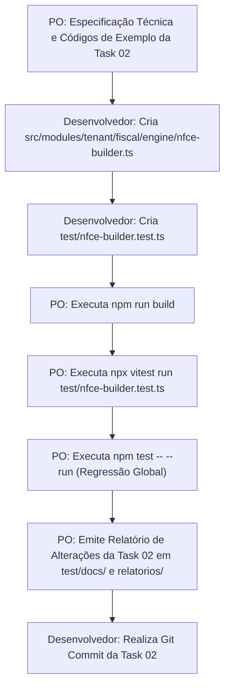

# Plano de Implementação — TASK 02 (Sprint 3 - Tenant)
## Construtor do XML NFC-e (Modelo 65) e Algoritmo de QR-Code 2.0 (Hash SHA-1 com Token CSC)

| Metadado | Detalhe |
|---|---|
| **Fase** | 2 — VTX Tenant (Sistema Fiscal Cloud Multi-Filial) |
| **Sprint** | 3 — Geração de XML PL_009_V4, QR-Code 2.0 e Assinador Digital Nativo XMLDSig |
| **Task** | 02 — Construtor do XML NFC-e (Modelo 65) e Algoritmo de QR-Code 2.0 |
| **Papel do PO** | Especificação de requisitos, fórmulas, auditoria de código, testes e relatórios |
| **Papel do Desenvolvedor** | Codificação de `src/modules/tenant/fiscal/engine/nfce-builder.ts` e `test/nfce-builder.test.ts` |
| **Padrão Normativo** | MOC SEFAZ v4.00, Manual do Padrão Técnico do DANFE NFC-e e QR Code v5.0/v6.0, PL_009_V4 |

---

## 1. Diretrizes Arquiteturais e Governança

1. **Separação Rígida de Papéis:**
   * O **Product Owner (PO)** especifica os requisitos de negócio, arquitetura, fórmulas matemáticas, interfaces e critérios de aceite, audita os resultados, executa os comandos de teste/build e emite os relatórios formais em `test/docs/` e `relatorios/`.
   * O **Desenvolvedor (Usuário)** implementa o código-fonte em `src/` e os arquivos de teste em `test/`.
2. **Autonomia e Padrões Criptográficos:**
   * Geração nativa em Node.js com o módulo nativo `crypto` para computação do hash SHA-1 autenticado via CSC, sem dependência de bibliotecas de terceiros.
3. **Reaproveitamento Modular (DRY):**
   * Reutilizar `calculateModulo11`, `generateAccessKey`, `xmlEscape` e `UF_TO_CUF` de `nfe-builder.ts`, passando `model: '65'`.

---

## 2. Arquitetura e Arquivos Envolvidos

| Tipo | Caminho | Responsável | Descrição |
|:---:|---|:---:|---|
| **[NEW]** | `src/modules/tenant/fiscal/engine/nfce-builder.ts` | Desenvolvedor | Construtor do XML da NFC-e Modelo 65, algoritmo de QR-Code 2.0 com CSC e contingência |
| **[NEW]** | `test/nfce-builder.test.ts` | Desenvolvedor | Suíte de testes unitários cobrindo QR-Code SHA-1, consumidor anônimo/identificado, troco e contingência |
| **[NEW]** | `test/docs/plano-implementacao-task-02-sprint-3-tenant.md` | PO | Documento canônico do plano de implementação da Task 02 com códigos de exemplo |
| **[NEW]** | `relatorios/plano-implementacao-task-02-sprint-3-tenant.md` | PO | Espelho do plano de implementação na pasta de relatórios |
| **[NEW]** | `test/docs/relatorio-alteracoes-task-02-sprint-3-tenant.md` | PO | Relatório formal de conformidade de 10 seções (pós-execução) |
| **[NEW]** | `relatorios/relatorio-alteracoes-task-02-sprint-3-tenant.md` | PO | Espelho do relatório formal na pasta de relatórios |

---

## 3. Especificação Técnica do QR-Code 2.0 da NFC-e

### 3.1. Composição dos Parâmetros Canônicos
A string de parâmetros `p` é estruturada com delimitador `&` e contém:
* `chNFe`: Chave de Acesso de 44 dígitos da NFC-e (`model = '65'`);
* `nVersao`: `2` (versão 2.0 do QR Code SEFAZ);
* `tpAmb`: `1` (Produção) ou `2` (Homologação);
* `cDest`: CPF ou CNPJ do consumidor (somente números, omitido se consumidor anônimo);
* `dhEmi`: Representação em hexadecimal dos bytes da data de emissão em formato ISO (`Buffer.from(dhEmiIso).toString('hex')`);
* `vNF`: Valor total da nota fiscal com 2 casas decimais (`.toFixed(2)`);
* `vICMS`: Valor total do ICMS (`0.00` no regime simplificado ou valor apurado);
* `digVal`: Hexadecimal do digest da nota (`Buffer.from(accessKey.slice(-8)).toString('hex')`);
* `cIdToken`: Identificador do CSC com 6 dígitos (`padStart(6, '0')`, ex: "000001").

### 3.2. Cálculo do Hash Autenticado SHA-1
O hash de integridade e autenticidade é computado concatenando a string de parâmetros ao código CSC secreto do contribuinte:
$$\text{hashSHA1} = \text{SHA1}(\text{stringParametros} + \text{cscToken})$$

### 3.3. URL Final e Nó Suplementar `<infNFeSupl>`
$$\text{URL} = \text{urlConsulta} + \text{"?p="} + \text{stringParametros} + \text{"|"} + \text{hashSHA1}$$

Estrutura no XML (posicionada como irmã direta de `<infNFe>`):
```xml
<infNFeSupl>
  <qrCode>${qrCodeUrl}</qrCode>
  <urlChave>${urlConsultaChave}</urlChave>
</infNFeSupl>
```

---

## 4. Códigos de Exemplo e Referência para Implementação

### 4.1. Código de Referência: `src/modules/tenant/fiscal/engine/nfce-builder.ts`

```typescript
import crypto from 'crypto'
import { z } from 'zod'
import {
    calculateModulo11,
    generateAccessKey,
    nfeCompanySchema,
    nfeItemInputSchema,
    nfePaymentSchema,
    UF_TO_CUF,
    xmlEscape
} from './nfe-builder'
import { calculateItemTaxes } from './tax-calculator'

// 1. Schema do Destinatário na NFC-e (Opcional - Consumidor Anônimo ou Identificado)
export const nfceCustomerSchema = z.object({
    cpfCnpj: z.string().regex(/^(\d{11}|\d{14})$/, 'CPF/CNPJ must be 11 or 14 numeric digits'),
    name: z.string().min(2).max(60).optional(),
    street: z.string().max(60).optional(),
    number: z.string().max(60).optional(),
    district: z.string().max(60).optional(),
    cityCode: z.string().regex(/^\d{7}$/).optional(),
    cityName: z.string().max(60).optional(),
    uf: z.string().length(2).toUpperCase().optional(),
    zipCode: z.string().regex(/^\d{8}$/).optional(),
    email: z.string().email().optional()
}).strict()

// 2. Schema de Entrada da NFC-e
export const nfceInputSchema = z.object({
    series: z.number().int().positive().default(1),
    number: z.number().int().positive(),
    naturezaOp: z.string().default('VENDA A CONSUMIDOR FINAL'),
    tpAmb: z.union([z.literal(1), z.literal(2)]).default(2),
    tpEmis: z.union([z.literal(1), z.literal(9)]).default(1), // 1=Normal, 9=Contingência Off-line
    emissionDate: z.date().optional(),
    dhCont: z.date().optional(), // Requerido se tpEmis === 9
    xJust: z.string().min(15).max(256).optional(), // Requerido se tpEmis === 9
    cNF: z.string().regex(/^\d{8}$/).optional(),
    cscIdToken: z.string().min(1).max(6), // Ex: "1" ou "000001"
    cscToken: z.string().min(16).max(36), // Segredo CSC fornecido pela SEFAZ
    urlConsultaQrCode: z.string().url().optional(),
    urlConsultaChave: z.string().url().optional(),
    company: nfeCompanySchema,
    customer: nfceCustomerSchema.optional(), // Opcional para NFC-e
    items: z.array(nfeItemInputSchema).min(1, 'NFC-e must have at least one item'),
    payments: z.array(nfePaymentSchema).min(1, 'NFC-e must have at least one payment'),
    vTroco: z.number().nonnegative().optional().default(0),
    additionalInfo: z.string().max(2000).optional()
}).strict()

export type NFCeInputDTO = z.infer<typeof nfceInputSchema>

export interface NFCeBuildResult {
    xml: string
    accessKey: string
    cDV: number
    cNF: string
    qrCodeUrl: string
    qrCodeHash: string
    totalInvoice: number
    totalIbs: number
    totalCbs: number
    totalIS: number
}

// 3. Algoritmo do QR-Code 2.0 (Hash SHA-1 com Token CSC)
export interface QRCodeParams {
    accessKey: string
    tpAmb: number
    cDest?: string
    dhEmi: Date
    vNF: number
    vICMS?: number
    digVal?: string
    cscIdToken: string
    cscToken: string
    urlConsulta?: string
}

export function generateQRCode2(params: QRCodeParams): { qrCodeUrl: string; qrCodeHash: string; paramsString: string } {
    const nVersao = 2
    const tpAmb = params.tpAmb
    const cDest = params.cDest ? params.cDest.replace(/\D/g, '') : ''
    const dhEmiIso = params.dhEmi.toISOString().replace(/\.\d{3}Z$/, '-03:00')
    const dhEmiHex = Buffer.from(dhEmiIso).toString('hex')
    const vNF = params.vNF.toFixed(2)
    const vICMS = (params.vICMS || 0).toFixed(2)
    const digVal = params.digVal || Buffer.from(params.accessKey.slice(-8)).toString('hex')
    const cIdToken = params.cscIdToken.padStart(6, '0')

    const parts = [
        `chNFe=${params.accessKey}`,
        `nVersao=${nVersao}`,
        `tpAmb=${tpAmb}`
    ]
    if (cDest) {
        parts.push(`cDest=${cDest}`)
    }
    parts.push(`dhEmi=${dhEmiHex}`)
    parts.push(`vNF=${vNF}`)
    parts.push(`vICMS=${vICMS}`)
    parts.push(`digVal=${digVal}`)
    parts.push(`cIdToken=${cIdToken}`)

    const paramsString = parts.join('&')
    const toHash = `${paramsString}${params.cscToken}`
    const qrCodeHash = crypto.createHash('sha1').update(toHash).digest('hex')

    const baseUrl = params.urlConsulta || (tpAmb === 1
        ? 'https://www.nfce.fazenda.sp.gov.br/qrcode'
        : 'https://homologacao.sat.fazenda.sp.gov.br/qrcode')

    const qrCodeUrl = `${baseUrl}?p=${paramsString}|${qrCodeHash}`

    return { qrCodeUrl, qrCodeHash, paramsString }
}

// 4. Construtor Principal da NFC-e (Modelo 65)
export function buildNFCeXml(rawInput: unknown): NFCeBuildResult {
    const input = nfceInputSchema.parse(rawInput)

    if (input.tpEmis === 9 && (!input.dhCont || !input.xJust)) {
        throw new Error('Contingency offline (tpEmis=9) requires dhCont and xJust')
    }

    const emissionDate = input.emissionDate || new Date()
    const { accessKey, cDV, cNF } = generateAccessKey({
        uf: input.company.uf,
        emissionDate,
        cnpj: input.company.cnpj,
        model: '65', // NFC-e
        series: input.series,
        number: input.number,
        tpEmis: input.tpEmis,
        cNF: input.cNF
    })

    const cUF = UF_TO_CUF[input.company.uf]
    const dhEmiIso = emissionDate.toISOString().replace(/\.\d{3}Z$/, '-03:00')

    let totalProducts = 0
    let totalDiscount = 0
    let totalIbsEstadual = 0
    let totalIbsMunicipal = 0
    let totalIbs = 0
    let totalCbs = 0
    let totalIS = 0
    let totalTrib = 0

    const itemsXml = input.items.map((item, index) => {
        const itemNumber = index + 1
        const taxResult = calculateItemTaxes({
            quantity: item.quantity,
            unitPrice: item.unitPrice,
            discount: item.discount,
            taxReformClass: item.taxReformClass,
            isSubjectToIS: item.isSubjectToIS,
            destinationUf: input.company.uf,
            destinationCityCode: input.company.cityCode,
            customRates: item.customRates
        })

        const itemTotalGross = item.quantity * item.unitPrice
        totalProducts += itemTotalGross
        totalDiscount += item.discount
        totalIbsEstadual += taxResult.taxReform.valorIbsEstadual
        totalIbsMunicipal += taxResult.taxReform.valorIbsMunicipal
        totalIbs += taxResult.taxReform.valorIbsTotal
        totalCbs += taxResult.taxReform.valorCbs
        totalIS += taxResult.taxReform.valorIS
        totalTrib += taxResult.taxReform.totalTaxReform

        return `
    <det nItem="${itemNumber}">
      <prod>
        <cProd>${xmlEscape(item.sku)}</cProd>
        <cEAN>SEM GTIN</cEAN>
        <xProd>${xmlEscape(item.description)}</xProd>
        <NCM>${item.ncm}</NCM>
        ${item.cest ? `<CEST>${item.cest}</CEST>` : ''}
        <CFOP>${item.cfop}</CFOP>
        <uCom>${xmlEscape(item.unit)}</uCom>
        <qCom>${item.quantity.toFixed(4)}</qCom>
        <vUnCom>${item.unitPrice.toFixed(4)}</vUnCom>
        <vProd>${itemTotalGross.toFixed(2)}</vProd>
        <cEANTrib>SEM GTIN</cEANTrib>
        <uTrib>${xmlEscape(item.unit)}</uTrib>
        <qTrib>${item.quantity.toFixed(4)}</qTrib>
        <vUnTrib>${item.unitPrice.toFixed(4)}</vUnTrib>
        ${item.discount > 0 ? `<vDesc>${item.discount.toFixed(2)}</vDesc>` : ''}
        <indTot>1</indTot>
      </prod>
      <imposto>
        <vTotTrib>${taxResult.taxReform.totalTaxReform.toFixed(2)}</vTotTrib>
        <ICMS>
          <ICMSSN102>
            <orig>0</orig>
            <CSOSN>102</CSOSN>
          </ICMSSN102>
        </ICMS>
        <PIS>
          <PISNT>
            <CST>07</CST>
          </PISNT>
        </PIS>
        <COFINS>
          <COFINSNT>
            <CST>07</CST>
          </COFINSNT>
        </COFINS>
        <IBS>
          <cstIBS>${taxResult.taxReform.cstIbsCbs}</cstIBS>
          <vBC>${taxResult.taxReform.baseIbs.toFixed(2)}</vBC>
          <pIBSUF>${taxResult.taxReform.aliqIbsEstadual.toFixed(2)}</pIBSUF>
          <vIBSUF>${taxResult.taxReform.valorIbsEstadual.toFixed(2)}</vIBSUF>
          <pIBSMun>${taxResult.taxReform.aliqIbsMunicipal.toFixed(2)}</pIBSMun>
          <vIBSMun>${taxResult.taxReform.valorIbsMunicipal.toFixed(2)}</vIBSMun>
          <vIBS>${taxResult.taxReform.valorIbsTotal.toFixed(2)}</vIBS>
        </IBS>
        <CBS>
          <cstCBS>${taxResult.taxReform.cstIbsCbs}</cstCBS>
          <vBC>${taxResult.taxReform.baseCbs.toFixed(2)}</vBC>
          <pCBS>${taxResult.taxReform.aliqCbs.toFixed(2)}</pCBS>
          <vCBS>${taxResult.taxReform.valorCbs.toFixed(2)}</vCBS>
        </CBS>
        ${taxResult.taxReform.valorIS > 0 ? `
        <IS>
          <vBC>${taxResult.taxReform.baseIS.toFixed(2)}</vBC>
          <pIS>${taxResult.taxReform.aliqIS.toFixed(2)}</pIS>
          <vIS>${taxResult.taxReform.valorIS.toFixed(2)}</vIS>
        </IS>` : ''}
      </imposto>
    </det>`
    }).join('')

    const totalInvoice = totalProducts - totalDiscount

    // QR-Code 2.0
    const { qrCodeUrl, qrCodeHash } = generateQRCode2({
        accessKey,
        tpAmb: input.tpAmb,
        cDest: input.customer?.cpfCnpj,
        dhEmi: emissionDate,
        vNF: totalInvoice,
        cscIdToken: input.cscIdToken,
        cscToken: input.cscToken,
        urlConsulta: input.urlConsultaQrCode
    })

    const urlChave = input.urlConsultaChave || (input.tpAmb === 1
        ? 'https://www.nfce.fazenda.sp.gov.br/consulta'
        : 'https://homologacao.sat.fazenda.sp.gov.br/consulta')

    // Destinatário opcional
    let destXml = ''
    if (input.customer) {
        const isPJ = input.customer.cpfCnpj.length === 14
        destXml = `
    <dest>
      ${isPJ ? `<CNPJ>${input.customer.cpfCnpj}</CNPJ>` : `<CPF>${input.customer.cpfCnpj}</CPF>`}
      ${input.customer.name ? `<xNome>${xmlEscape(input.customer.name)}</xNome>` : ''}
      <indIEDest>9</indIEDest>
      ${input.customer.email ? `<email>${xmlEscape(input.customer.email)}</email>` : ''}
    </dest>`
    }

    const paymentsXml = input.payments.map((p) => `
      <detPag>
        <tPag>${p.tPag}</tPag>
        <vPag>${p.vPag.toFixed(2)}</vPag>
      </detPag>`).join('')

    const infCpl = input.additionalInfo
        ? `${xmlEscape(input.additionalInfo)} - Valores de tributos apurados conforme EC 132/2023.`
        : 'Valores de tributos apurados de acordo com a Reforma Tributária (EC 132/2023).'

    const xml = `<NFe xmlns="http://www.portalfiscal.inf.br/nfe">
  <infNFe Id="NFe${accessKey}" versao="4.00">
    <ide>
      <cUF>${cUF}</cUF>
      <cNF>${cNF}</cNF>
      <natOp>${xmlEscape(input.naturezaOp)}</natOp>
      <mod>65</mod>
      <serie>${input.series}</serie>
      <nNF>${input.number}</nNF>
      <dhEmi>${dhEmiIso}</dhEmi>
      <tpNF>1</tpNF>
      <idDest>1</idDest>
      <cMunFG>${input.company.cityCode}</cMunFG>
      <tpImp>4</tpImp>
      <tpEmis>${input.tpEmis}</tpEmis>
      <cDV>${cDV}</cDV>
      <tpAmb>${input.tpAmb}</tpAmb>
      <finNFe>1</finNFe>
      <indFinal>1</indFinal>
      <indPres>1</indPres>
      <procEmi>0</procEmi>
      <verProc>VTX_1.0</verProc>
      ${input.tpEmis === 9 ? `
      <dhCont>${input.dhCont?.toISOString().replace(/\.\d{3}Z$/, '-03:00')}</dhCont>
      <xJust>${xmlEscape(input.xJust || 'Emissao em contingencia offline')}</xJust>` : ''}
    </ide>
    <emit>
      <CNPJ>${input.company.cnpj}</CNPJ>
      <xNome>${xmlEscape(input.company.socialName)}</xNome>
      ${input.company.fantasyName ? `<xFant>${xmlEscape(input.company.fantasyName)}</xFant>` : ''}
      <enderEmit>
        <xLgr>${xmlEscape(input.company.street)}</xLgr>
        <nro>${xmlEscape(input.company.number)}</nro>
        ${input.company.complement ? `<xCpl>${xmlEscape(input.company.complement)}</xCpl>` : ''}
        <xBairro>${xmlEscape(input.company.district)}</xBairro>
        <cMun>${input.company.cityCode}</cMun>
        <xMun>${xmlEscape(input.company.cityName)}</xMun>
        <UF>${input.company.uf}</UF>
        <CEP>${input.company.zipCode}</CEP>
        <cPais>1058</cPais>
        <xPais>Brasil</xPais>
        ${input.company.phone ? `<fone>${input.company.phone}</fone>` : ''}
      </enderEmit>
      <IE>${input.company.ie}</IE>
      <CRT>${input.company.crt}</CRT>
    </emit>${destXml}${itemsXml}
    <total>
      <ICMSTot>
        <vBC>0.00</vBC>
        <vICMS>0.00</vICMS>
        <vICMSDeson>0.00</vICMSDeson>
        <vFCPUFDest>0.00</vFCPUFDest>
        <vICMSUFDest>0.00</vICMSUFDest>
        <vICMSUFRemet>0.00</vICMSUFRemet>
        <vFCP>0.00</vFCP>
        <vBCST>0.00</vBCST>
        <vST>0.00</vST>
        <vFCPST>0.00</vFCPST>
        <vFCPSTRet>0.00</vFCPSTRet>
        <vProd>${totalProducts.toFixed(2)}</vProd>
        <vFrete>0.00</vFrete>
        <vSeg>0.00</vSeg>
        <vDesc>${totalDiscount.toFixed(2)}</vDesc>
        <vII>0.00</vII>
        <vIPI>0.00</vIPI>
        <vIPIDevol>0.00</vIPIDevol>
        <vPIS>0.00</vPIS>
        <vCOFINS>0.00</vCOFINS>
        <vOutro>0.00</vOutro>
        <vNF>${totalInvoice.toFixed(2)}</vNF>
        <vTotTrib>${totalTrib.toFixed(2)}</vTotTrib>
      </ICMSTot>
      <IBSTot>
        <vBCIBS>${totalProducts.toFixed(2)}</vBCIBS>
        <vIBSUF>${totalIbsEstadual.toFixed(2)}</vIBSUF>
        <vIBSMun>${totalIbsMunicipal.toFixed(2)}</vIBSMun>
        <vIBS>${totalIbs.toFixed(2)}</vIBS>
      </IBSTot>
      <CBSTot>
        <vBCCBS>${totalProducts.toFixed(2)}</vBCCBS>
        <vCBS>${totalCbs.toFixed(2)}</vCBS>
      </CBSTot>
      ${totalIS > 0 ? `
      <ISTot>
        <vBCIS>${totalProducts.toFixed(2)}</vBCIS>
        <vIS>${totalIS.toFixed(2)}</vIS>
      </ISTot>` : ''}
    </total>
    <transp>
      <modFrete>9</modFrete>
    </transp>
    <pag>${paymentsXml}
      ${input.vTroco > 0 ? `<vTroco>${input.vTroco.toFixed(2)}</vTroco>` : ''}
    </pag>
    <infAdic>
      <infCpl>${infCpl}</infCpl>
    </infAdic>
  </infNFe>
  <infNFeSupl>
    <qrCode>${qrCodeUrl}</qrCode>
    <urlChave>${urlChave}</urlChave>
  </infNFeSupl>
</NFe>`

    return {
        xml,
        accessKey,
        cDV,
        cNF,
        qrCodeUrl,
        qrCodeHash,
        totalInvoice,
        totalIbs,
        totalCbs,
        totalIS
    }
}
```

---

### 4.2. Código de Referência: `test/nfce-builder.test.ts`

```typescript
import { describe, expect, it } from 'vitest'
import { buildNFCeXml, generateQRCode2 } from '../src/modules/tenant/fiscal/engine/nfce-builder'

describe('NFCe Builder Engine & QR-Code 2.0 (Task 02 - Sprint 3)', () => {
    const validCompany = {
        cnpj: '12345678000195',
        socialName: 'Mercado Exemplo LTDA',
        fantasyName: 'Mercado Bom Preço',
        ie: '123456789',
        crt: '1' as const,
        street: 'Rua do Comércio',
        number: '500',
        district: 'Centro',
        cityCode: '3550308',
        cityName: 'São Paulo',
        uf: 'SP',
        zipCode: '01001000',
        phone: '11988887777'
    }

    const cscMock = {
        cscIdToken: '000001',
        cscToken: 'A1B2C3D4E5F60718293A4B5C6D7E8F90'
    }

    describe('1. Algoritmo do QR-Code Versão 2.0', () => {
        it('deve gerar a string de parâmetros e o hash SHA-1 autenticado pelo CSC', () => {
            const qrResult = generateQRCode2({
                accessKey: '35260912345678000195650010000000011123456784',
                tpAmb: 2,
                dhEmi: new Date('2026-09-23T15:30:00-03:00'),
                vNF: 150.00,
                cscIdToken: cscMock.cscIdToken,
                cscToken: cscMock.cscToken
            })

            expect(qrResult.paramsString).toContain('chNFe=35260912345678000195650010000000011123456784')
            expect(qrResult.paramsString).toContain('nVersao=2')
            expect(qrResult.paramsString).toContain('tpAmb=2')
            expect(qrResult.paramsString).toContain('vNF=150.00')
            expect(qrResult.paramsString).toContain('cIdToken=000001')
            expect(qrResult.qrCodeHash).toHaveLength(40) // Hash SHA-1 tem 40 hex chars
            expect(qrResult.qrCodeUrl).toContain(`?p=${qrResult.paramsString}|${qrResult.qrCodeHash}`)
        })

        it('deve incluir cDest quando houver consumidor identificado', () => {
            const qrResult = generateQRCode2({
                accessKey: '35260912345678000195650010000000011123456784',
                tpAmb: 2,
                cDest: '12345678909',
                dhEmi: new Date('2026-09-23T15:30:00-03:00'),
                vNF: 50.00,
                cscIdToken: cscMock.cscIdToken,
                cscToken: cscMock.cscToken
            })

            expect(qrResult.paramsString).toContain('cDest=12345678909')
        })
    })

    describe('2. Construtor de XML da NFC-e (Modelo 65)', () => {
        it('deve gerar NFC-e para consumidor anônimo (sem tag <dest>)', () => {
            const result = buildNFCeXml({
                series: 1,
                number: 1,
                cscIdToken: cscMock.cscIdToken,
                cscToken: cscMock.cscToken,
                company: validCompany,
                items: [
                    {
                        sku: 'SKU-CAFE',
                        description: 'Café Torrado 500g',
                        ncm: '09012100',
                        cfop: '5102',
                        unit: 'UN',
                        quantity: 2,
                        unitPrice: 18.50
                    }
                ],
                payments: [
                    { tPag: '01', vPag: 37.00 }
                ]
            })

            expect(result.accessKey).toHaveLength(44)
            expect(result.accessKey.slice(20, 22)).toBe('65') // Modelo 65
            expect(result.xml).toContain('<mod>65</mod>')
            expect(result.xml).toContain('<tpImp>4</tpImp>') // DANFE NFC-e
            expect(result.xml).not.toContain('<dest>')
            expect(result.xml).toContain('<infNFeSupl>')
            expect(result.xml).toContain('<qrCode>')
            expect(result.xml).toContain('<urlChave>')
            expect(result.totalInvoice).toBe(37.00)
        })

        it('deve gerar NFC-e para consumidor identificado (com CPF no <dest>)', () => {
            const result = buildNFCeXml({
                series: 1,
                number: 2,
                cscIdToken: cscMock.cscIdToken,
                cscToken: cscMock.cscToken,
                company: validCompany,
                customer: {
                    cpfCnpj: '12345678909',
                    name: 'Consumidor da Silva'
                },
                items: [
                    {
                        sku: 'SKU-LEITE',
                        description: 'Leite Integral 1L',
                        ncm: '04012010',
                        cfop: '5102',
                        unit: 'UN',
                        quantity: 4,
                        unitPrice: 5.50
                    }
                ],
                payments: [
                    { tPag: '17', vPag: 22.00 }
                ]
            })

            expect(result.xml).toContain('<dest>')
            expect(result.xml).toContain('<CPF>12345678909</CPF>')
            expect(result.xml).toContain('<xNome>Consumidor da Silva</xNome>')
            expect(result.qrCodeUrl).toContain('cDest=12345678909')
        })

        it('deve registrar valor de troco quando informado', () => {
            const result = buildNFCeXml({
                series: 1,
                number: 3,
                cscIdToken: cscMock.cscIdToken,
                cscToken: cscMock.cscToken,
                company: validCompany,
                items: [
                    {
                        sku: 'SKU-PÃO',
                        description: 'Pão Francês KG',
                        ncm: '19059090',
                        cfop: '5102',
                        unit: 'KG',
                        quantity: 1,
                        unitPrice: 15.00
                    }
                ],
                payments: [
                    { tPag: '01', vPag: 20.00 } // Pagou 20
                ],
                vTroco: 5.00 // Troco de 5
            })

            expect(result.xml).toContain('<vTroco>5.00</vTroco>')
        })

        it('deve gerar tags de contingência off-line quando tpEmis = 9', () => {
            const dhCont = new Date('2026-09-23T16:00:00-03:00')
            const result = buildNFCeXml({
                series: 1,
                number: 4,
                tpEmis: 9,
                dhCont,
                xJust: 'Falha de conexao com o servidor da SEFAZ autorizadora',
                cscIdToken: cscMock.cscIdToken,
                cscToken: cscMock.cscToken,
                company: validCompany,
                items: [
                    {
                        sku: 'SKU-AGUA',
                        description: 'Água Mineral 500ml',
                        ncm: '22011000',
                        cfop: '5102',
                        unit: 'UN',
                        quantity: 1,
                        unitPrice: 3.00
                    }
                ],
                payments: [
                    { tPag: '01', vPag: 3.00 }
                ]
            })

            expect(result.xml).toContain('<tpEmis>9</tpEmis>')
            expect(result.xml).toContain('<dhCont>')
            expect(result.xml).toContain('<xJust>Falha de conexao com o servidor da SEFAZ autorizadora</xJust>')
            expect(result.accessKey[34]).toBe('9') // tpEmis na chave é '9'
        })

        it('deve rejeitar contingência off-line sem dhCont ou xJust', () => {
            expect(() => {
                buildNFCeXml({
                    series: 1,
                    number: 5,
                    tpEmis: 9,
                    cscIdToken: cscMock.cscIdToken,
                    cscToken: cscMock.cscToken,
                    company: validCompany,
                    items: [
                        {
                            sku: 'SKU-001',
                            description: 'Item Teste',
                            ncm: '12345678',
                            cfop: '5102',
                            unit: 'UN',
                            quantity: 1,
                            unitPrice: 10
                        }
                    ],
                    payments: [
                        { tPag: '01', vPag: 10 }
                    ]
                })
            }).toThrow(/Contingency offline/)
        })

        it('deve calcular corretamente os grupos da Reforma Tributária (IBS e CBS)', () => {
            const result = buildNFCeXml({
                series: 1,
                number: 6,
                cscIdToken: cscMock.cscIdToken,
                cscToken: cscMock.cscToken,
                company: validCompany,
                items: [
                    {
                        sku: 'SKU-ITEM',
                        description: 'Produto Comum com IVA Dual',
                        ncm: '84713012',
                        cfop: '5102',
                        unit: 'UN',
                        quantity: 1,
                        unitPrice: 100.00,
                        taxReformClass: 'PADRAO'
                    }
                ],
                payments: [
                    { tPag: '17', vPag: 100.00 }
                ]
            })

            expect(result.xml).toContain('<IBS>')
            expect(result.xml).toContain('<CBS>')
            expect(result.xml).toContain('<IBSTot>')
            expect(result.xml).toContain('<CBSTot>')
            expect(result.totalIbs).toBeGreaterThan(0)
            expect(result.totalCbs).toBeGreaterThan(0)
        })
    })
})
```

---

## 5. Roteiro de Execução Passo a Passo


