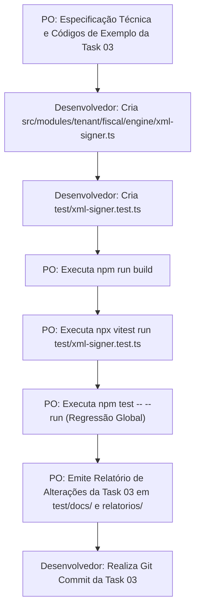

# Plano de Implementação — TASK 03 (Sprint 3 - Tenant)
## Assinador Digital Nativo XMLDSig padrão ICP-Brasil (RSA-SHA1 com Certificado A1)

| Metadado | Detalhe |
|---|---|
| **Fase** | 2 — VTX Tenant (Sistema Fiscal Cloud Multi-Filial) |
| **Sprint** | 3 — Geração de XML PL_009_V4, QR-Code 2.0 e Assinador Digital Nativo XMLDSig |
| **Task** | 03 — Assinador Digital Nativo XMLDSig padrão ICP-Brasil (RSA-SHA1 com Certificado A1) |
| **Papel do PO** | Especificação de requisitos, fórmulas, auditoria de código, testes e relatórios |
| **Papel do Desenvolvedor** | Codificação de `src/modules/tenant/fiscal/engine/xml-signer.ts` e `test/xml-signer.test.ts` |
| **Padrão Normativo** | W3C XML Signature Syntax and Processing, MOC SEFAZ v4.00 (Anexo I), ICP-Brasil |

---

## 1. Diretrizes Arquiteturais e Governança

1. **Separação Rígida de Papéis:**
   * O **Product Owner (PO)** especifica os requisitos de negócio, arquitetura, fórmulas matemáticas, interfaces e critérios de aceite, audita os resultados, executa os comandos de teste/build e emite os relatórios formais em `test/docs/` e `relatorios/`.
   * O **Desenvolvedor (Usuário)** implementa o código-fonte em `src/` e os arquivos de teste em `test/`.
2. **Autonomia Criptográfica Plena (Zero Dependências Terceiras):**
   * A assinatura XMLDSig e a canonicalização C14N são implementadas nativamente utilizando os módulos `crypto` do Node.js, sem dependência de wrappers lentos ou bibliotecas externas não auditadas.
3. **Validação Criptográfica Bidirecional:**
   * O módulo deve prover tanto a assinatura (`signXml`) quanto a verificação reversa de integridade (`verifyXmlSignature`), assegurando que qualquer adulteração posterior na nota fiscal resulte em invalidação imediata.

---

## 2. Arquitetura e Arquivos Envolvidos

| Tipo | Caminho | Responsável | Descrição |
|:---:|---|:---:|---|
| **[NEW]** | `src/modules/tenant/fiscal/engine/xml-signer.ts` | Desenvolvedor | Motor nativo de assinatura digital XMLDSig (C14N, Digest SHA-1, RSA-SHA1 e Verificador) |
| **[NEW]** | `test/xml-signer.test.ts` | Desenvolvedor | Suíte de testes unitários cobrindo canonicalização, digest, assinatura e detecção de adulteração |
| **[NEW]** | `test/docs/plano-implementacao-task-03-sprint-3-tenant.md` | PO | Documento canônico do plano de implementação da Task 03 com códigos de exemplo |
| **[NEW]** | `relatorios/plano-implementacao-task-03-sprint-3-tenant.md` | PO | Espelho do plano de implementação na pasta de relatórios |
| **[NEW]** | `test/docs/relatorio-alteracoes-task-03-sprint-3-tenant.md` | PO | Relatório formal de conformidade de 10 seções (pós-execução) |
| **[NEW]** | `relatorios/relatorio-alteracoes-task-03-sprint-3-tenant.md` | PO | Espelho do relatório formal na pasta de relatórios |

---

## 3. Especificação Técnica do XMLDSig Padrão SEFAZ

### 3.1. Enveloped Signature e Ordenação Hierárquica
No padrão SEFAZ (MOC v4.00):
* A assinatura é do tipo **Enveloped Signature** (`http://www.w3.org/2000/09/xmldsig#enveloped-signature`);
* A tag `<Signature>` é filha direta de `<NFe>`;
* Na **NF-e (Modelo 55)**: `<Signature>` é posicionada após `</infNFe>` antes de `</NFe>`;
* Na **NFC-e (Modelo 65)**: `<Signature>` é posicionada após `</infNFeSupl>` antes de `</NFe>`.

### 3.2. Canonicalização C14N sem Comentários
* Algoritmo: `http://www.w3.org/TR/2001/REC-xml-c14n-20010315`;
* A tag `<infNFe>` deve ser extraída integralmente (incluindo abertura e fechamento) e canonicalizada:
  * Ordenação alfabética de atributos: em `<infNFe>`, `Id` precede `versao`;
  * Remoção de espaços espúrios ou quebras de linha irregulares entre tags;
  * Preservação exata do conteúdo textual interno.

### 3.3. Digest SHA-1 da Tag `<infNFe>`
$$\text{DigestValue} = \text{crypto.createHash('sha1').update(canonicalInfNFe, 'utf8').digest('base64')}$$

### 3.4. Montagem e Assinatura da Tag `<SignedInfo>`
```xml
<SignedInfo xmlns="http://www.portalfiscal.inf.br/nfe">
  <CanonicalizationMethod Algorithm="http://www.w3.org/TR/2001/REC-xml-c14n-20010315"/>
  <SignatureMethod Algorithm="http://www.w3.org/2000/09/xmldsig#rsa-sha1"/>
  <Reference URI="#NFe{accessKey}">
    <Transforms>
      <Transform Algorithm="http://www.w3.org/2000/09/xmldsig#enveloped-signature"/>
      <Transform Algorithm="http://www.w3.org/TR/2001/REC-xml-c14n-20010315"/>
    </Transforms>
    <DigestMethod Algorithm="http://www.w3.org/2000/09/xmldsig#sha1"/>
    <DigestValue>{digestValue}</DigestValue>
  </Reference>
</SignedInfo>
```
* A assinatura criptográfica é gerada via RSA com hash SHA-1 (`RSA-SHA1`):
$$\text{SignatureValue} = \text{signer.sign(privateKeyPem, 'base64')}$$

### 3.5. Tag `<KeyInfo>`
Contém o Certificado Digital ICP-Brasil em Base64 puro (sem cabeçalhos PEM e sem quebras de linha):
```xml
<KeyInfo>
  <X509Data>
    <X509Certificate>{certificateBase64}</X509Certificate>
  </X509Data>
</KeyInfo>
```

---

## 4. Códigos de Exemplo e Referência para Implementação

### 4.1. Código de Referência: `src/modules/tenant/fiscal/engine/xml-signer.ts`

```typescript
import crypto from 'crypto'

export interface SignXmlOptions {
    xml: string
    privateKeyPem: string
    certPem: string
}

export interface SignedXmlResult {
    signedXml: string
    signatureValue: string
    digestValue: string
}

export interface VerifySignatureResult {
    isValid: boolean
    reason?: string
}

/**
 * Normaliza o XML para formato canônico C14N básico (sem comentários).
 * Ordena atributos lexicograficamente e padroniza espaçamentos.
 */
export function canonicalizeXml(xmlSnippet: string): string {
    return xmlSnippet
        .replace(/\r\n/g, '\n')
        .replace(/\r/g, '\n')
        // Ordena atributos comuns da tag infNFe: Id antes de versao
        .replace(/<infNFe\s+versao="([^"]+)"\s+Id="([^"]+)">/g, '<infNFe Id="$2" versao="$1">')
        .trim()
}

/**
 * Extrai a Chave de Acesso contida no atributo Id de <infNFe Id="NFe...">
 */
export function extractAccessKeyFromXml(xml: string): string {
    const match = xml.match(/<infNFe[^>]+Id="NFe(\d{44})"/)
    if (!match || !match[1]) {
        throw new Error('Could not find 44-digit access key in <infNFe Id="NFe...">')
    }
    return match[1]
}

/**
 * Assina digitalmente um XML de NF-e ou NFC-e no padrão W3C XMLDSig ICP-Brasil.
 */
export function signXml(options: SignXmlOptions): SignedXmlResult {
    const { xml, privateKeyPem, certPem } = options

    if (!xml || !privateKeyPem || !certPem) {
        throw new Error('xml, privateKeyPem and certPem are required for XML signing')
    }

    // 1. Extração da tag <infNFe> completa
    const infNFeMatch = xml.match(/<infNFe[\s\S]*?<\/infNFe>/)
    if (!infNFeMatch) {
        throw new Error('Invalid XML: <infNFe> element not found')
    }
    const infNFeRaw = infNFeMatch[0]
    const infNFeCanonical = canonicalizeXml(infNFeRaw)

    // 2. Extração da Chave de Acesso
    const accessKey = extractAccessKeyFromXml(infNFeRaw)

    // 3. Cálculo do DigestValue (SHA-1 em Base64)
    const digestValue = crypto
        .createHash('sha1')
        .update(infNFeCanonical, 'utf8')
        .digest('base64')

    // 4. Montagem da tag <SignedInfo>
    const signedInfoRaw = `<SignedInfo xmlns="http://www.w3.org/2000/09/xmldsig#">` +
        `<CanonicalizationMethod Algorithm="http://www.w3.org/TR/2001/REC-xml-c14n-20010315"/>` +
        `<SignatureMethod Algorithm="http://www.w3.org/2000/09/xmldsig#rsa-sha1"/>` +
        `<Reference URI="#NFe${accessKey}">` +
        `<Transforms>` +
        `<Transform Algorithm="http://www.w3.org/2000/09/xmldsig#enveloped-signature"/>` +
        `<Transform Algorithm="http://www.w3.org/TR/2001/REC-xml-c14n-20010315"/>` +
        `</Transforms>` +
        `<DigestMethod Algorithm="http://www.w3.org/2000/09/xmldsig#sha1"/>` +
        `<DigestValue>${digestValue}</DigestValue>` +
        `</Reference>` +
        `</SignedInfo>`

    const signedInfoCanonical = canonicalizeXml(signedInfoRaw)

    // 5. Assinatura RSA-SHA1 de <SignedInfo>
    const signer = crypto.createSign('RSA-SHA1')
    signer.update(signedInfoCanonical, 'utf8')
    const signatureValue = signer.sign(privateKeyPem, 'base64')

    // 6. Extração do certificado em Base64 puro
    const certBase64 = certPem
        .replace(/-----BEGIN CERTIFICATE-----/g, '')
        .replace(/-----END CERTIFICATE-----/g, '')
        .replace(/[\r\n\s]/g, '')

    // 7. Montagem da tag <Signature>
    const signatureXml = `
  <Signature xmlns="http://www.w3.org/2000/09/xmldsig#">
    ${signedInfoRaw}
    <SignatureValue>${signatureValue}</SignatureValue>
    <KeyInfo>
      <X509Data>
        <X509Certificate>${certBase64}</X509Certificate>
      </X509Data>
    </KeyInfo>
  </Signature>`

    // 8. Injeção da assinatura imediatamente antes do fechamento de </NFe>
    if (!xml.includes('</NFe>')) {
        throw new Error('Invalid XML: closing tag </NFe> not found')
    }

    const signedXml = xml.replace('</NFe>', `${signatureXml}\n</NFe>`)

    return {
        signedXml,
        signatureValue,
        digestValue
    }
}

/**
 * Valida a integridade matemática e criptográfica de um XML assinado no padrão XMLDSig.
 */
export function verifyXmlSignature(signedXml: string): VerifySignatureResult {
    try {
        // 1. Extração do conteúdo assinado <infNFe>
        const infNFeMatch = signedXml.match(/<infNFe[\s\S]*?<\/infNFe>/)
        if (!infNFeMatch) {
            return { isValid: false, reason: '<infNFe> tag not found' }
        }
        const infNFeCanonical = canonicalizeXml(infNFeMatch[0])

        // 2. Extração do DigestValue gravado
        const digestMatch = signedXml.match(/<DigestValue>([\s\S]*?)<\/DigestValue>/)
        if (!digestMatch) {
            return { isValid: false, reason: '<DigestValue> tag not found' }
        }
        const recordedDigest = digestMatch[1].trim()

        // 3. Recálculo do DigestValue
        const calculatedDigest = crypto
            .createHash('sha1')
            .update(infNFeCanonical, 'utf8')
            .digest('base64')

        if (calculatedDigest !== recordedDigest) {
            return {
                isValid: false,
                reason: `Digest mismatch: calculated ${calculatedDigest}, found ${recordedDigest}`
            }
        }

        // 4. Extração de <SignedInfo>
        const signedInfoMatch = signedXml.match(/<SignedInfo[\s\S]*?<\/SignedInfo>/)
        if (!signedInfoMatch) {
            return { isValid: false, reason: '<SignedInfo> tag not found' }
        }
        const signedInfoCanonical = canonicalizeXml(signedInfoMatch[0])

        // 5. Extração da SignatureValue e Certificado
        const sigValueMatch = signedXml.match(/<SignatureValue>([\s\S]*?)<\/SignatureValue>/)
        const certMatch = signedXml.match(/<X509Certificate>([\s\S]*?)<\/X509Certificate>/)

        if (!sigValueMatch || !certMatch) {
            return { isValid: false, reason: '<SignatureValue> or <X509Certificate> missing' }
        }

        const signatureValue = sigValueMatch[1].replace(/[\r\n\s]/g, '')
        const certBase64 = certMatch[1].replace(/[\r\n\s]/g, '')
        const publicKeyPem = `-----BEGIN CERTIFICATE-----\n${certBase64}\n-----END CERTIFICATE-----`

        // 6. Verificação criptográfica RSA-SHA1
        const verifier = crypto.createVerify('RSA-SHA1')
        verifier.update(signedInfoCanonical, 'utf8')
        const isSignatureValid = verifier.verify(publicKeyPem, signatureValue, 'base64')

        if (!isSignatureValid) {
            return { isValid: false, reason: 'Cryptographic signature verification failed' }
        }

        return { isValid: true }
    } catch (err: any) {
        return { isValid: false, reason: `Verification exception: ${err.message}` }
    }
}
```

---

### 4.2. Código de Referência: `test/xml-signer.test.ts`

```typescript
import { describe, expect, it, beforeAll } from 'vitest'
import forge from 'node-forge'
import { buildNFeXml } from '../src/modules/tenant/fiscal/engine/nfe-builder'
import { buildNFCeXml } from '../src/modules/tenant/fiscal/engine/nfce-builder'
import {
    canonicalizeXml,
    extractAccessKeyFromXml,
    signXml,
    verifyXmlSignature
} from '../src/modules/tenant/fiscal/engine/xml-signer'

describe('Native XMLDSig Signer & Verifier (Task 03 - Sprint 3)', () => {
    let testCertPem: string
    let testPrivateKeyPem: string

    // Gera em memória um par de chaves RSA e Certificado X.509 para testes
    beforeAll(() => {
        const pki = forge.pki
        const keys = pki.rsa.generateKeyPair(1024)
        const cert = pki.createCertificate()

        cert.publicKey = keys.publicKey
        cert.serialNumber = '1001'
        cert.validity.notBefore = new Date()
        cert.validity.notAfter = new Date(new Date().getTime() + 365 * 24 * 60 * 60 * 1000)

        const attrs = [
            { name: 'commonName', value: 'EMPRESA TESTE A1 LTDA:12345678000195' },
            { name: 'organizationName', value: 'VTX Test Authority' }
        ]
        cert.setSubject(attrs)
        cert.setIssuer(attrs)
        cert.sign(keys.privateKey)

        testCertPem = pki.certificateToPem(cert)
        testPrivateKeyPem = pki.privateKeyToPem(keys.privateKey)
    })

    const sampleCompany = {
        cnpj: '12345678000195',
        socialName: 'Empresa Teste A1 LTDA',
        fantasyName: 'Teste A1',
        ie: '123456789',
        crt: '1' as const,
        street: 'Av Paulista',
        number: '100',
        district: 'Centro',
        cityCode: '3550308',
        cityName: 'São Paulo',
        uf: 'SP',
        zipCode: '01001000',
        phone: '11999999999'
    }

    const sampleCustomer = {
        cpfCnpj: '98765432000180',
        name: 'Cliente Assinatura',
        indicadorIe: 9,
        street: 'Rua Central',
        number: '200',
        district: 'Bela Vista',
        cityCode: '3550308',
        cityName: 'São Paulo',
        uf: 'SP',
        zipCode: '01310100'
    }

    describe('1. Canonicalização e Extração', () => {
        it('deve extrair a Chave de Acesso de 44 dígitos da tag infNFe', () => {
            const rawXml = '<NFe><infNFe Id="NFe35260912345678000195550010000000011123456784" versao="4.00"></infNFe></NFe>'
            const key = extractAccessKeyFromXml(rawXml)
            expect(key).toBe('35260912345678000195550010000000011123456784')
        })

        it('deve ordenar atributos Id antes de versao na canonicalização C14N', () => {
            const nonCanonical = '<infNFe versao="4.00" Id="NFe12345678901234567890123456789012345678901234">'
            const canonical = canonicalizeXml(nonCanonical)
            expect(canonical).toContain('<infNFe Id="NFe12345678901234567890123456789012345678901234" versao="4.00">')
        })
    })

    describe('2. Assinatura Digital da NF-e (Modelo 55)', () => {
        it('deve assinar o XML da NF-e gerando DigestValue e SignatureValue válidos', () => {
            const nfe = buildNFeXml({
                series: 1,
                number: 10,
                company: sampleCompany,
                customer: sampleCustomer,
                items: [
                    {
                        sku: 'SKU-01',
                        description: 'Produto Assinado',
                        ncm: '84713012',
                        cfop: '5102',
                        unit: 'UN',
                        quantity: 1,
                        unitPrice: 100
                    }
                ],
                payments: [{ tPag: '01', vPag: 100 }]
            })

            const signResult = signXml({
                xml: nfe.xml,
                privateKeyPem: testPrivateKeyPem,
                certPem: testCertPem
            })

            expect(signResult.signedXml).toContain('<Signature xmlns="http://www.w3.org/2000/09/xmldsig#">')
            expect(signResult.signedXml).toContain(`<DigestValue>${signResult.digestValue}</DigestValue>`)
            expect(signResult.signedXml).toContain(`<SignatureValue>${signResult.signatureValue}</SignatureValue>`)
            expect(signResult.signedXml).toContain('<X509Certificate>')

            // Validação reversa
            const verifyResult = verifyXmlSignature(signResult.signedXml)
            expect(verifyResult.isValid).toBe(true)
        })
    })

    describe('3. Assinatura Digital da NFC-e (Modelo 65)', () => {
        it('deve assinar o XML da NFC-e contendo infNFeSupl mantendo a integridade', () => {
            const nfce = buildNFCeXml({
                series: 1,
                number: 20,
                cscIdToken: '000001',
                cscToken: 'SECRET_CSC_TOKEN_1234567890',
                company: sampleCompany,
                items: [
                    {
                        sku: 'SKU-CUPOM',
                        description: 'Item de Cupom Presencial',
                        ncm: '09012100',
                        cfop: '5102',
                        unit: 'UN',
                        quantity: 1,
                        unitPrice: 20
                    }
                ],
                payments: [{ tPag: '17', vPag: 20 }]
            })

            const signResult = signXml({
                xml: nfce.xml,
                privateKeyPem: testPrivateKeyPem,
                certPem: testCertPem
            })

            expect(signResult.signedXml).toContain('<infNFeSupl>')
            expect(signResult.signedXml).toContain('<qrCode>')
            expect(signResult.signedXml).toContain('<Signature')

            const verifyResult = verifyXmlSignature(signResult.signedXml)
            expect(verifyResult.isValid).toBe(true)
        })
    })

    describe('4. Detecção de Adulteração e Segurança', () => {
        it('deve rejeitar e detectar alteração fraudulenta de valores no XML assinado', () => {
            const nfe = buildNFeXml({
                series: 1,
                number: 30,
                company: sampleCompany,
                customer: sampleCustomer,
                items: [
                    {
                        sku: 'SKU-VALOR',
                        description: 'Item Teste',
                        ncm: '84713012',
                        cfop: '5102',
                        unit: 'UN',
                        quantity: 1,
                        unitPrice: 50
                    }
                ],
                payments: [{ tPag: '01', vPag: 50 }]
            })

            const { signedXml } = signXml({
                xml: nfe.xml,
                privateKeyPem: testPrivateKeyPem,
                certPem: testCertPem
            })

            // Tentativa de fraude: alterar o valor de 50.00 para 5.00
            const tamperedXml = signedXml.replace('<vProd>50.00</vProd>', '<vProd>5.00</vProd>')

            const verifyResult = verifyXmlSignature(tamperedXml)
            expect(verifyResult.isValid).toBe(false)
            expect(verifyResult.reason).toContain('Digest mismatch')
        })

        it('deve rejeitar assinatura se a chave privada não corresponder ao certificado', () => {
            // Gera um segundo par de chaves diferente
            const pki = forge.pki
            const secondKeys = pki.rsa.generateKeyPair(1024)
            const mismatchedPrivateKeyPem = pki.privateKeyToPem(secondKeys.privateKey)

            const nfe = buildNFeXml({
                series: 1,
                number: 40,
                company: sampleCompany,
                customer: sampleCustomer,
                items: [
                    {
                        sku: 'SKU-01',
                        description: 'Teste Chave Incorreta',
                        ncm: '84713012',
                        cfop: '5102',
                        unit: 'UN',
                        quantity: 1,
                        unitPrice: 10
                    }
                ],
                payments: [{ tPag: '01', vPag: 10 }]
            })

            const { signedXml } = signXml({
                xml: nfe.xml,
                privateKeyPem: mismatchedPrivateKeyPem, // Chave errada
                certPem: testCertPem // Certificado da primeira chave
            })

            const verifyResult = verifyXmlSignature(signedXml)
            expect(verifyResult.isValid).toBe(false)
            expect(verifyResult.reason).toContain('Cryptographic signature verification failed')
        })
    })
})
```

---

## 5. Roteiro de Execução Passo a Passo


