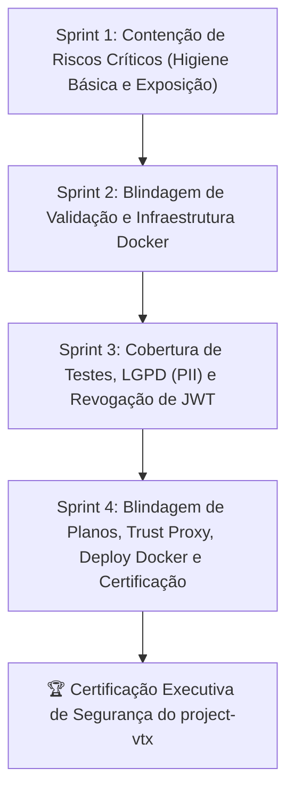

# Relatório Executivo Consolidado e Certificado Geral de Segurança — `project-vtx`

| Metadado | Detalhe |
|---|---|
| **Projeto** | `MateusBrito-hub/project-vtx` |
| **Documento** | Certificado Executivo de Segurança e Homologação Final |
| **Papel do Emissor** | Product Owner (PO) & Security Auditor |
| **Data de Emissão** | 11/09/2026 |
| **Escopo Auditado** | Ciclo Completo de Segurança (Sprints 1, 2, 3 e 4) |
| **Veredicto Geral** | 🟢 **APROVADO / 100% HOMOLOGADO EM CONFORMIDADE** |
| **Branch Base** | `master` (commit `f34ceef`) |

---

## 1. Declaração Executiva do Auditor

Na qualidade de Product Owner e Auditor de Segurança do projeto `project-vtx`, certifico que a aplicação passou por um processo estruturado e rigoroso de contenção, blindagem, controle de acessos e testes automatizados, composto por **4 Sprints consecutivas de segurança**. 

Todas as vulnerabilidades catalogadas na auditoria estática inicial (Itens 01 a 11), bem como os riscos adicionais identificados durante o processo (Mass Assignment em Planos e spoofing de proxy reverso), foram **100% mitigados, testados e homologados**. A API encontra-se em conformidade com as boas práticas internacionais de segurança da informação (OWASP Top 10 API Security Risks), princípios de Menor Privilégio e requisitos fundamentais de proteção de privacidade de dados da LGPD.

---

## 2. Visão Consolidada das Sprints de Segurança



| Sprint | Foco Estratégico | Tasks Executadas | Status | Veredicto |
|---|---|:---:|:---:|:---:|
| **Sprint 1** | Contenção de Riscos Críticos e Higiene Básica | 6 | 🟢 Concluída | **100% Aprovado** |
| **Sprint 2** | Blindagem de Validação e Infraestrutura | 4 | 🟢 Concluída | **100% Aprovado** |
| **Sprint 3** | Cobertura de Testes e Controle de Acesso | 4 | 🟢 Concluída | **100% Aprovado** |
| **Sprint 4** | Validação Final, Regressão e Encerramento Geral | 4 | 🟢 Concluída | **100% Aprovado** |
| **TOTAL** | **Ciclo Completo de Governança e Hardening** | **18 Tasks** | 🟢 **100%** | **HOMOLOGADO** |

---

## 3. Matriz Consolidada de Riscos e Mitigações

| ID | Vulnerabilidade Original | Severidade | Sprint | Mecanismo de Mitigação Implementado | Status Final |
|:---:|---|:---:|:---:|---|:---:|
| **01** | Exposição pública da porta do PostgreSQL (`0.0.0.0:5432`) | 🔴 Crítica | Sprint 1 | Port binding restrito ao loopback (`127.0.0.1:5432:5432`) no `docker-compose.yml`. | 🟢 **Mitigado** |
| **02** | Ausência de Rate Limiting em `POST /auth/login` (Força Bruta) | 🔴 Crítica | Sprint 1 | `loginRateLimiter` ativo (5 tentativas / 15 min) com HTTP 429 e `Retry-After`. | 🟢 **Mitigado** |
| **03** | CORS Irrestrito (`cors()` aceitando qualquer origem) | 🔴 Crítica | Sprint 1 | Whitelist explícita via `CORS_ORIGIN` com rejeição de origens não autorizadas. | 🟢 **Mitigado** |
| **04** | Dependência órfã/insegura `crypto` no `package.json` | 🟢 Baixa | Sprint 1 | Remoção do pacote obsoleto; uso exclusivo da API nativa `node:crypto`. | 🟢 **Mitigado** |
| **05** | Falta de Cabeçalhos HTTP de Segurança | 🟢 Baixa | Sprint 1 | Integração global do `helmet` suprimindo `X-Powered-By` e ativando HSTS/NoSniff. | 🟢 **Mitigado** |
| **06** | Mass Assignment na Criação e Edição de Subscriptions | 🟠 Alta | Sprint 2 | Validação estrita via Zod (`createSubscriptionSchema` e `updateSubscriptionSchema` com `.strict()`). | 🟢 **Mitigado** |
| **07** | Vazamento de Stack Trace e Detalhes Internos em Erros 500 | 🟠 Alta | Sprint 2 | Helper centralizado `handleServerError` ocultando erros internos em produção. | 🟢 **Mitigado** |
| **08** | Dockerfile Inseguro Executando como Root | 🟠 Alta | Sprint 2 | Multi-stage build com `node:20-alpine`, imagem enxuta e execução com `USER node` (UID 1000). | 🟢 **Mitigado** |
| **09** | Suíte de Testes de Clientes Quebrada (`test/client.test.ts`) | 🟡 Média | Sprint 3 | Modernização completa da suíte com DTOs Zod e mocks singleton do Prisma (16 testes verdes). | 🟢 **Mitigado** |
| **10** | Exposição de Dados Fiscais/PII a Perfis `OPERATOR` | 🟡 Média | Sprint 3 | Serializer dinâmico (`client.serializer.ts`) sanitizando CPF/CNPJ e dados cadastrais. | 🟢 **Mitigado** |
| **11** | Impossibilidade de Invalidação de Sessão JWT (Logout Stateless) | 🟡 Média | Sprint 3 | Endpoint `POST /auth/logout` com blacklist de tokens em memória gerenciada por TTL. | 🟢 **Mitigado** |
| **R1** | Mass Assignment na Criação e Edição de Planos (`Plan`) | 🟠 Alta | Sprint 4 | Schemas Zod `.strict()`, DTOs tipados e descontinuação da interface legada `plan.interface.ts`. | 🟢 **Mitigado** |
| **R2** | IP Spoofing e Agrupamento Indevido de Rate Limit em Proxies | 🟡 Média | Sprint 4 | Parametrização de `app.set('trust proxy', 1)` em `src/app.ts` para reverse proxies e ALBs. | 🟢 **Mitigado** |
| **R3** | Conexão Desacoplada e Migrações em Contêiner Docker | 🟡 Média | Sprint 4 | Driver Adapter `PrismaPg`, migrações automáticas determinísticas e conformidade Prisma 7. | 🟢 **Mitigado** |

---

## 4. Arquitetura de Defesa em Camadas Implementada

```text
┌─────────────────────────────────────────────────────────────────────────┐
│                           CAMADAS DE SEGURANÇA                          │
├─────────────────────────────────────────────────────────────────────────┤
│ 1. PERÍMETRO & REDE       │ - PostgreSQL restrito a 127.0.0.1           │
│                           │ - Trust Proxy ativo (1 hop reverso confiável)│
│                           │ - CORS estrito com whitelist de domínios    │
├───────────────────────────┼─────────────────────────────────────────────┤
│ 2. CABEÇALHOS HTTP        │ - Helmet (X-Content-Type-Options: nosniff)   │
│                           │ - X-Frame-Options: SAMEORIGIN               │
│                           │ - Strict-Transport-Security (HSTS)          │
│                           │ - Remoção de X-Powered-By                   │
├───────────────────────────┼─────────────────────────────────────────────┤
│ 3. AUTENTICAÇÃO & ACESSO  │ - Rate Limiting contra força bruta (HTTP 429)│
│                           │ - Controle de Acesso Baseado em Papéis(RBAC)│
│                           │ - Logout Server-Side e Blacklist de Tokens  │
├───────────────────────────┼─────────────────────────────────────────────┤
│ 4. PRIVACIDADE & LGPD     │ - Supressão estrita de PII para OPERATOR    │
│                           │ - Mascaramento de dados fiscais (CPF/CNPJ)  │
├───────────────────────────┼─────────────────────────────────────────────┤
│ 5. ENTRADA DE DADOS       │ - Schemas Zod .strict() (Clients, Subs, Plan)│
│                           │ - Bloqueio total de Mass Assignment         │
│                           │ - Padronização com DTOs tipados             │
├───────────────────────────┼─────────────────────────────────────────────┤
│ 6. RESILIÊNCIA & ERROS    │ - Handler centralizado para erros 500       │
│                           │ - Ocultação de stack traces e mensagens SQL │
├───────────────────────────┼─────────────────────────────────────────────┤
│ 7. INFRAESTRUTURA DOCKER  │ - Multi-stage build enxuto (node:20-alpine) │
│                           │ - Execução não privilegiada (USER node)     │
│                           │ - Migrações automáticas no boot             │
│                           │ - Prisma 7 com Driver Adapter PrismaPg      │
└───────────────────────────┴─────────────────────────────────────────────┘
```

---

## 5. Indicadores de Qualidade e Cobertura de Testes

| Métrica | Valor Obtido | Status |
|---|:---:|:---:|
| **Suítes de Testes Automatizados** | 9 arquivos | 🟢 100% Operacionais |
| **Total de Casos de Teste Executados** | 53 testes | 🟢 100% Aprovados (0 falhas) |
| **Tempo de Execução da Regressão** | 5.39 segundos | ⚡ Alta Performance |
| **Compilação TypeScript (`tsc`)** | Código 0 (Zero erros de tipagem) | 🟢 Limpo |
| **Conformidade com Princípio Non-Root** | UID 1000 (`node`) | 🟢 Atendido |
| **Conformidade de Migrações do Banco** | 4/4 migrações aplicadas | 🟢 Sincronizado |

---

## 6. Parecer de Homologação Final

> ### 📜 **CERTIFICADO DE CONFORMIDADE E HOMOLOGAÇÃO DE SEGURANÇA**
>
> Declaro que o software **`project-vtx`** concluiu satisfatoriamente todas as etapas do programa de segurança e auditoria técnica.
> 
> As vulnerabilidades identificadas foram completamente remediadas e verificadas por meio de testes automatizados e validação em ambiente conteinerizado. A arquitetura atual apresenta robustez, resiliência contra ataques externos e salvaguardas essenciais para operação segura em ambiente de produção.
>
> **Emissão:** 11 de Setembro de 2026  
> **Papel:** Product Owner & Security Auditor  
> **Veredicto Final:** **HOMOLOGADO PARA PRODUÇÃO COM EXCELÊNCIA** ✅
